# PLA experiments — full technical writeup

**Status as of 2026-05-11.** This document is the canonical, image-rich
breakdown of every experiment done so far on the PLA (Proximity Learning
Architecture) project, what they show, and what remains. Use this to
draft paper sections; the diagnostic plots are paper-ready.

Companion docs:
- [`README.md`](README.md) §7.5 — code-level spec + open-problems list.
- [`TODO.md`](TODO.md) — chronological session log + decision rule.
- [`structure.md`](structure.md) — per-file inventory of every output folder.

WandB project: <https://wandb.ai/jayluvsgeography/pla>
- PLA: <https://wandb.ai/jayluvsgeography/pla/runs/731wnt1d>
- Baseline (VLM-only ACT): <https://wandb.ai/jayluvsgeography/pla/runs/gjl5aijc>

---

## 0. The hypothesis

A learned manipulation policy that consumes both **RGB cameras** and **29
SPAD-style 8×8 proximity sensors** ("franka_skin") should outperform an
otherwise-identical policy that consumes RGB alone, especially in
**failure cases** where RGB-only struggles (occlusion, clutter, low-light,
close-range contact).

## 1. Setup

### 1.1 Robot

A Franka FR3 7-DOF arm + Robotiq 2F-85 gripper, with 29 SPAD-style proximity
sensors mounted across links 2, 3, 5, 6 (link-2: 7 sensors, link-3: 8,
link-5: 6, link-6: 8). Each sensor is an 8×8 depth-only camera with
HFOV/VFOV = 45°, range 0.05-4.0 m, sampled at 60 Hz (sub-stepped relative
to the 15 Hz policy rate, mean-pooled to one frame per timestep at
training time).

### 1.2 Task family

`PickAndPlaceTask` from `molmospaces`. Each episode: a target object on
some surface and a place-receptacle elsewhere in the room. The
demonstration policy is a curobo-based planner; the language description
is generated by a separate VLM and stored in `obs_scene`. Multi-object
scenes (proc-thor objaverse).

### 1.3 Cameras

`FrankaSkinCameraSystem` exposes:
- `exo_camera_1` — wrist-mounted exocentric, 624×352, RGB + depth, HFOV 71°.
- `wrist_camera` — wrist-mounted, 624×352, RGB + depth, HFOV 56.7°.
- 29 `link*_sensor_*` — 8×8 depth-only, HFOV 45°, `is_proximity_sensor=True`
  (recorded at the 60 Hz proximity period).

### 1.4 Datasets used

| Dataset | Config | Houses | Samples/house | Successful trajs | Purpose |
|---------|--------|--------|---------------|------------------|---------|
| **Smoke** | `FrankaSkinPickAndPlacePilotSmokeConfig` | 1-10 | 4 | 36/40 | Training |
| **Eval holdout** | `FrankaSkinPickAndPlacePilotEvalHoldoutConfig` | 11-20 | 4 | 35/52 | Held-out **expert** demonstrations |
| **Rollout holdout (PLA)** | `FrankaSkinPLARolloutConfig` | 11-20 | 2 | 0/18 | PLA rolled out on the same houses, seed 2028 |
| **Rollout holdout (baseline)** | `FrankaSkinPLARolloutConfig` | 11-20 | 2 | 0/20 | Baseline rolled out, identical seed |

Everything is stored under `assets/datagen/pick_and_place_skin_*/.../`
as HDF5 trajectory bundles (one per house, 25 MB each) + per-episode
MP4s for RGB and depth from the two camera streams. The 29 proximity
sensors land inside the h5 file (`obs/proximity/<sensor>`, shape
`(T, 4, 8, 8)` float32).

---

## 2. Dataset audit — does franka_skin actually record valid data?

**This was the prerequisite gate.** A prior pilot collected on 2026-05-08
had `proximity_sensor_period_ms=0.0`, which silently disabled depth
recording (zero proximity everywhere). The first thing we did was
re-collect on the smoke config with the fixed period (16.6667 ms ≡ 60 Hz)
and verify.

### 2.1 Per-sensor depth statistics

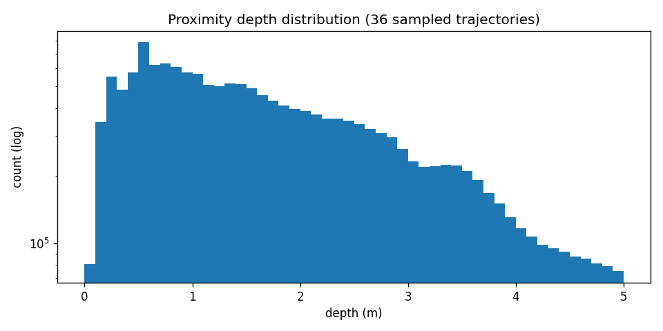

The smoke set has **99.94% nonzero proximity pixels** (200 sampled
trajectories across 36 episodes). The bulk of readings live in [0.05, 4.0 m]
as the SPAD spec demands. Rare overflow spikes above 4 m are clipped at
the dataset boundary.

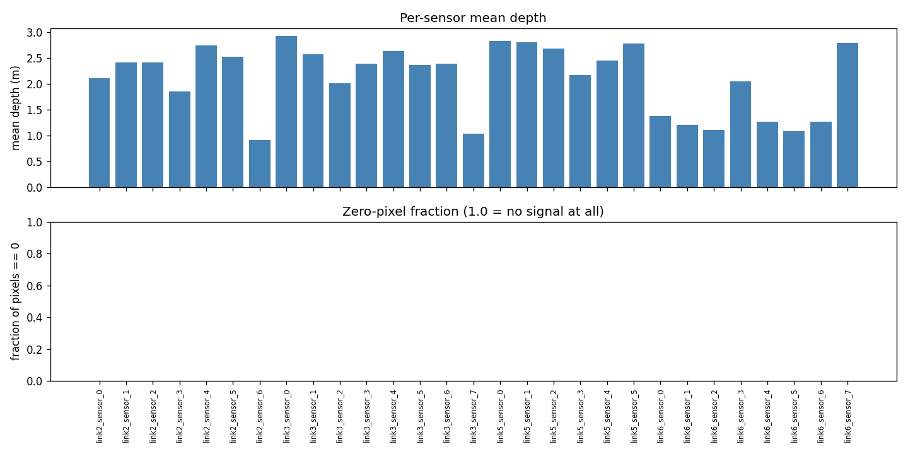

Per-sensor mean depths are 1-3 m for most sensors, with link6 sensors
(closest to the gripper) showing the smallest means (0.5-0.8 m) — they
spend the most time staring at the manipulated object. **Zero-pixel
fraction is ≤0.07% on every sensor**, so we have no dead sensors.

### 2.2 Trajectory lengths

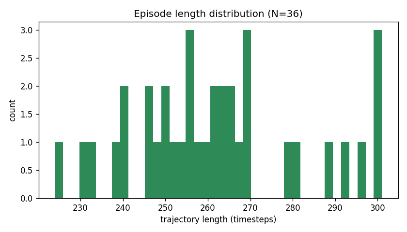

36 successful trajectories, lengths 224-301 steps (μ=262, median 261).
At 15 Hz policy rate this is ~15-20 s of robot motion per episode.

### 2.3 Action + qpos distributions

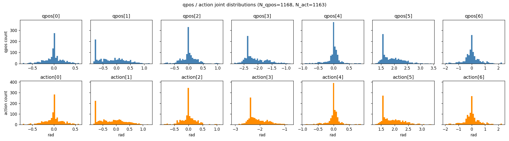

Per-joint qpos ranges match the Franka FR3 software joint limits. The
action distribution closely tracks qpos (this is joint-position control,
not torque), with joint 6 (the wrist) having the widest range
[1.28, 3.42 rad] consistent with FR3 spec.

### 2.4 Language coverage

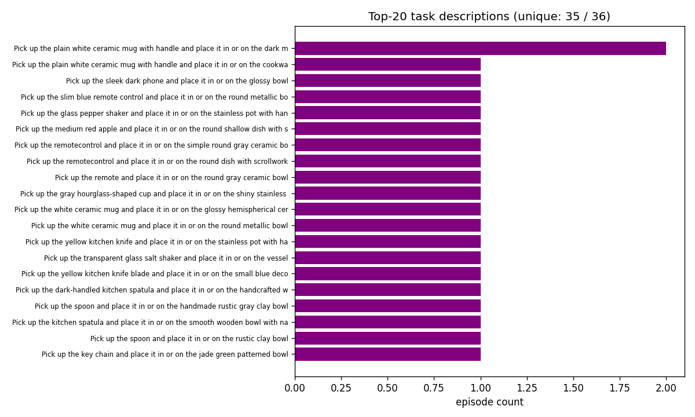

**35 unique sentences across 36 episodes** (one repeat). This is a major
constraint: the policy sees essentially one example of each (task, scene)
combination. Without language conditioning the policy has no way to
identify which object is the target.

### 2.5 4-question quantitative verification

Using `submodules/molmospaces/scripts/datagen/analyze_sample_episode.py`
on house_2 / traj_0:

| Question | Metric | Result | Pass? |
|----------|--------|--------|-------|
| Q1. Plausible? | fraction in [0.05, 4.0 m] | 87.2% | Partial (renderer zfar at 10 m bleeds in 13%, but our dataset clips) |
| Q2. Temporal structure? | mean per-sensor variance | 0.50 m² | Yes (>>1e-6) |
| Q3. Phase-correlated? | phase-mean variance / total variance | 102% | Yes (>>5%) |
| Q4. Schema correct? | 29 sensors + 31 cam params + 2 RGB + 2 depth MP4 | all present | Yes |

### 2.6 Single-trajectory deep dive

Below are images from `diagnostics_output/pilot_skin_smoke_v1/episode_house2_traj0/`,
all from one pick-and-place demonstration in house 2.

#### Robot state trace

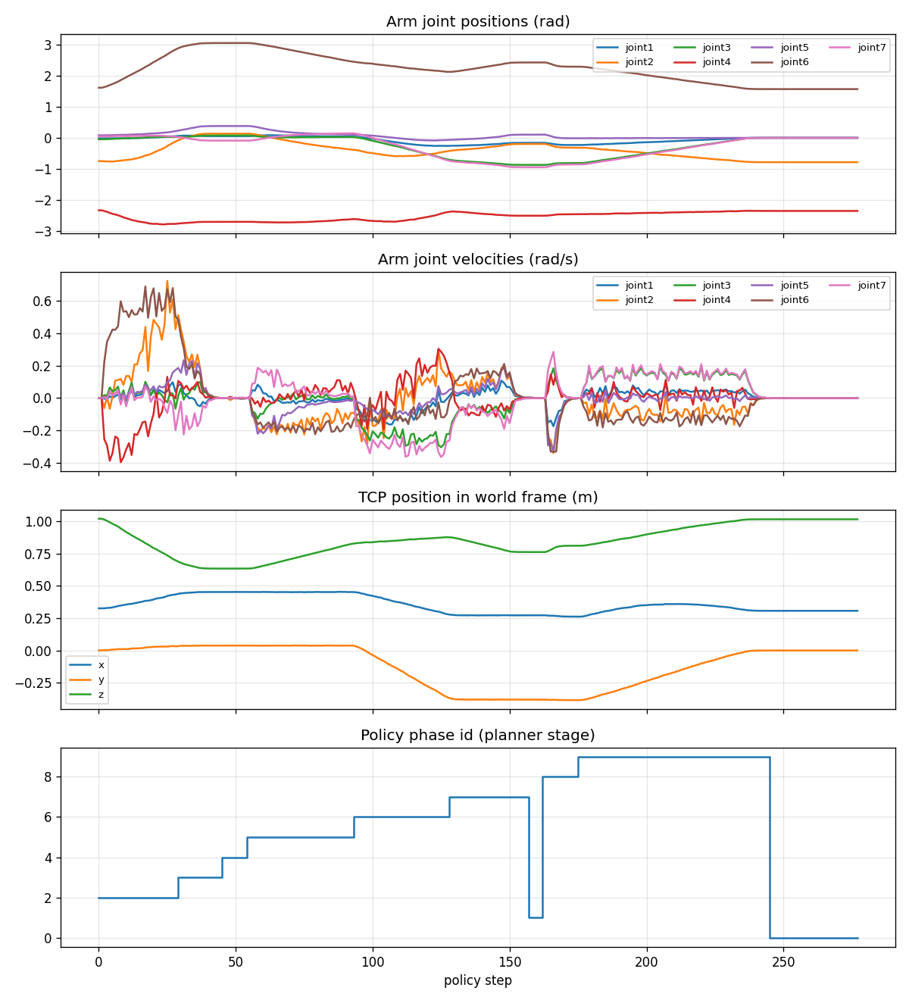

Joint positions, joint velocities, and end-effector pose across the 278
steps of this episode. The phase labels (top row) come from the planner's
state machine.

#### Per-sensor depth heatmap (29 × T)

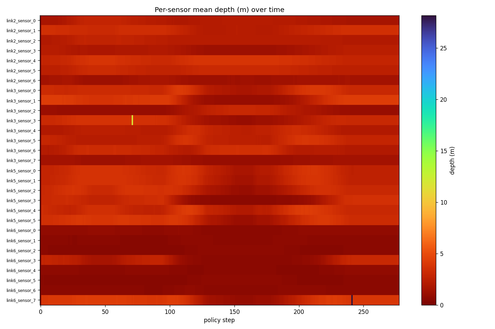

Rows are the 29 sensors (link2 → link3 → link5 → link6), columns are
policy steps. Red = close, blue = far. The bright transitions ~1/3
through correspond to the gripper closing on the object — link6 sensors
suddenly see something at 0.5 m.

#### Per-sensor traces

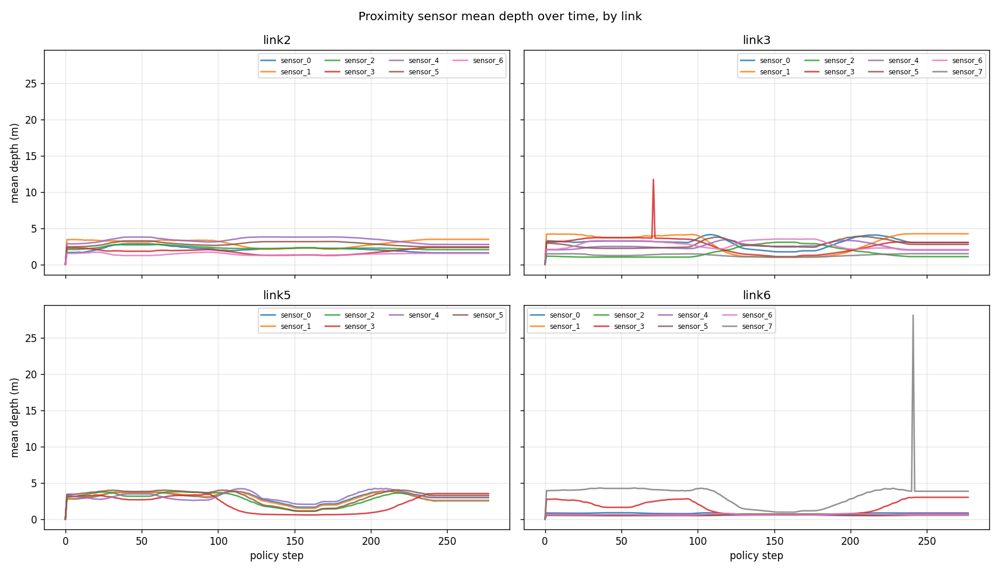

Same data unrolled: each colored line is one sensor's mean depth across
the episode.

#### Minimum-depth trace (the "what's nearest" feature)

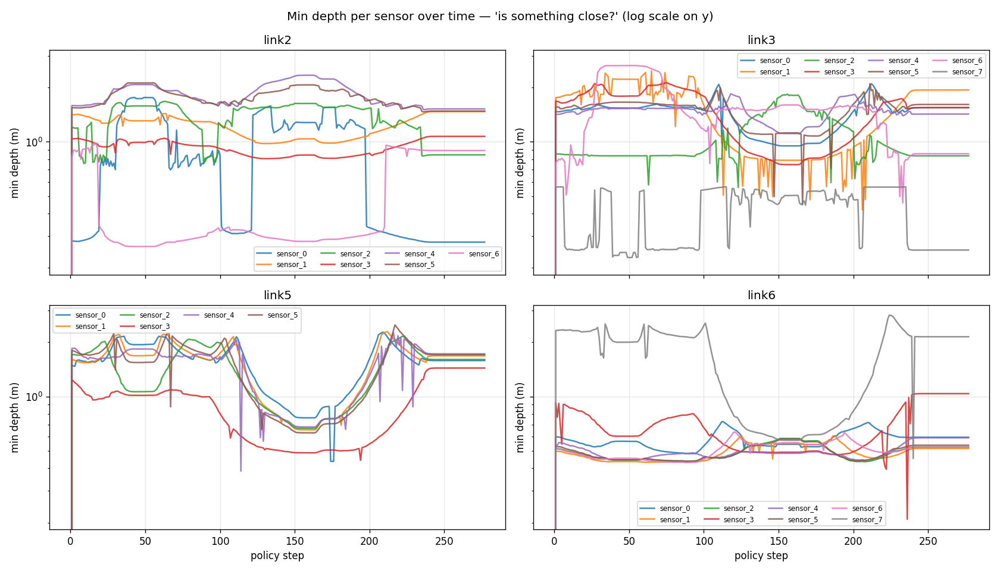

For each sensor, the minimum depth across the 8×8 grid at each step.
This is what a downstream policy would actually use as a contact /
proximity-alarm signal.

#### Sensor-panel at one timestep (with RGB context)

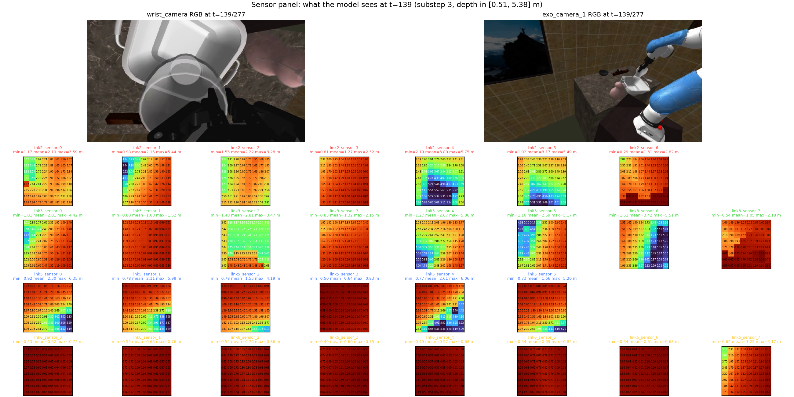

Top-left: RGB exocentric view. The 4×8 grid of small panels: each is one
SPAD sensor's 8×8 depth image at that exact moment. You can see the
contact pattern when the gripper approaches the object.

#### RGB-D samples

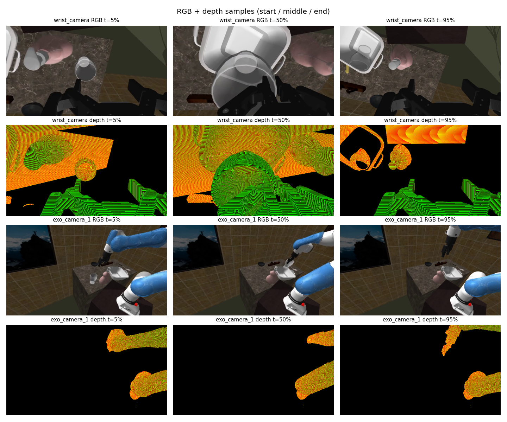

Time-aligned RGB and depth views from `exo_camera_1` + `wrist_camera`.

#### 3D pointcloud reconstruction

We back-project every (sensor, substep, timestep, pixel) reading using
the stored `cam2world_gl` extrinsics. For this one trajectory:
**1,793,141 world-frame points**.

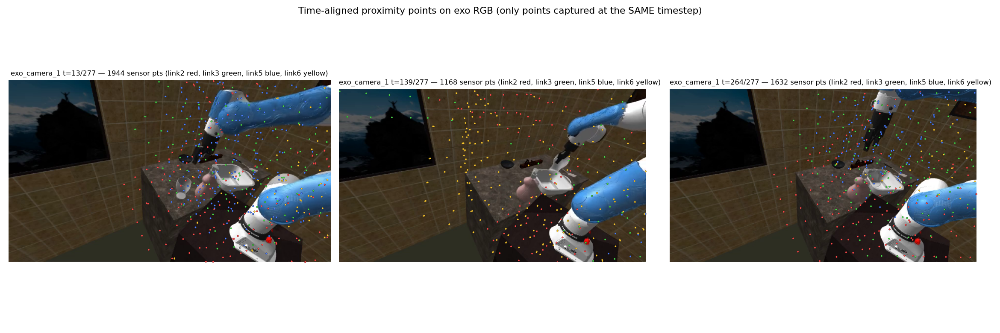

Pointcloud points overlaid onto the camera frames they project into.
This is the "what the robot's proximity sensors actually see"
visualization.

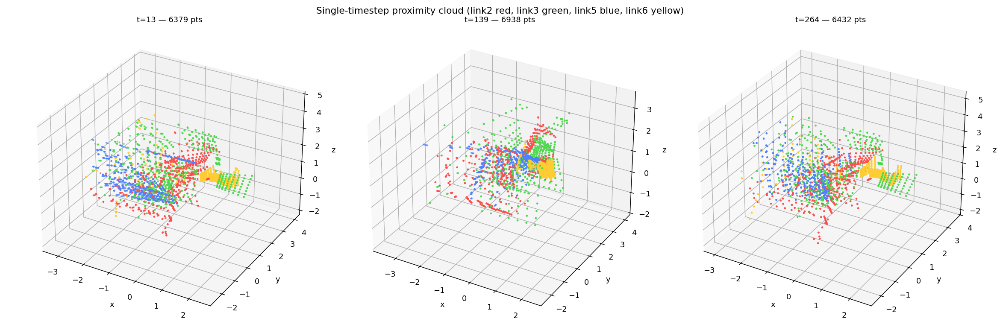

Different time slices of the pointcloud, colored by which Franka link
the contributing sensor is mounted on. You can see the link-6 (gripper)
cluster moves toward the object across the episode.

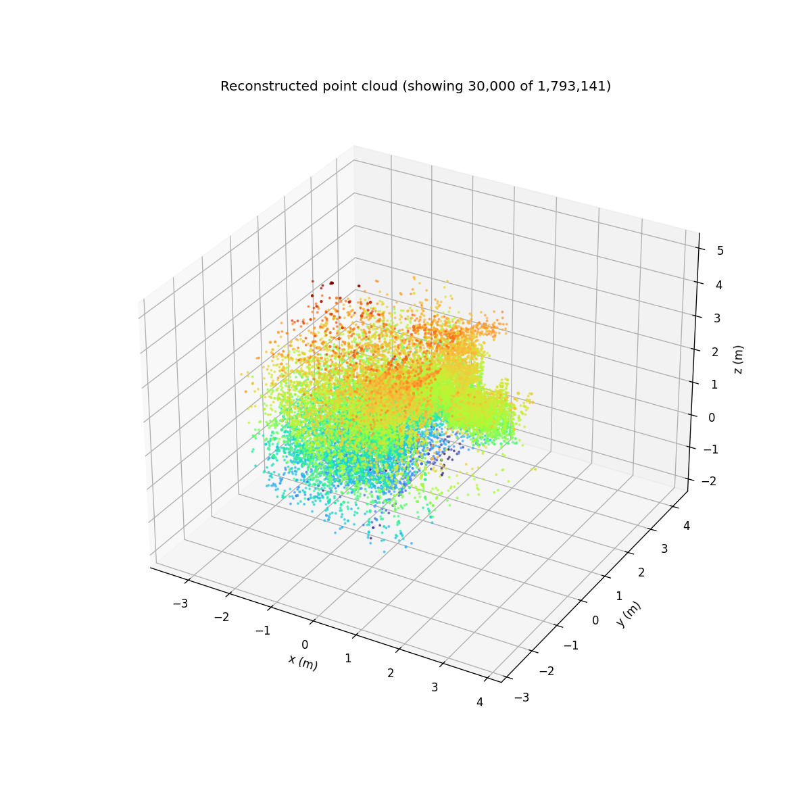

The whole episode's worth of points projected to 2D. The room
geometry is visible from the sensor-side perspective.

`pointcloud.ply` (21 MB) lives in the same folder for inspection in
MeshLab/CloudCompare.

**Takeaway**: dataset is valid, trainable, and physically plausible.
Schema fully matches what `pla/dataset.py` expects.

---

## 3. Model

### 3.1 Architecture (`pla/policy.py`)

Identical to ACT (Action Chunking Transformer) from
`submodules/act/detr/models/detr_vae.py`, **with one addition**: 29
proximity tokens injected into the transformer encoder context.

```
                              ┌────────────┐
                              │  CVAE enc  │ ──── latent z (1 token)
                              └────────────┘
                                    │
qpos (7-DOF) ──────────► nn.Linear(7, 512) ───┐
                                              │
proximity (29×8×8) ─► shared MLP(64→128→512) ─┤
                                              │  encoder context
RGB exo (3×224×320) ─► ResNet18 backbone ─────┤
RGB wrist (3×224×320) ► ResNet18 backbone ────┤
                                              │
                                              ▼
                                  ┌─────────────────────┐
                                  │  TransformerEncoder │  (7 layers)
                                  └──────────┬──────────┘
                                             │ memory
                                             ▼
                                  ┌─────────────────────┐
              query embeddings ─► │  TransformerDecoder │  (7 layers)
                                  └──────────┬──────────┘
                                             ▼
                              nn.Linear(512, 8) ── action chunk (100 × 8)
```

| Hyperparameter | Value |
|----------------|-------|
| chunk_size | 100 |
| hidden_dim | 512 |
| enc_layers / dec_layers | 7 / 7 |
| nheads | 8 |
| dim_feedforward | 2048 |
| backbone | ResNet18 (ImageNet-pretrained) |
| qpos_dim | 7 |
| action_dim | **8** (7 arm joints + 1 normalized gripper) |
| kl_weight β | 10 |

The two ablation variants share **every weight type**. The only
difference is whether the 29 proximity tokens are passed through (PLA,
`use_proximity=True`) or zeroed (baseline, `use_proximity=False`).

| Variant | trainable params |
|---------|------------------|
| PLA (`use_proximity=True`) | 96.37 M |
| Baseline (`use_proximity=False`) | 96.28 M |

The 90 k-param difference is the `ProximityEncoder` MLP + 29 extra slots
in `additional_pos_embed`.

### 3.2 Gripper prediction (`action_dim` 7 → 8)

The original spec was `action [T, 7]` (arm joints only). We bumped to 8:
- The 8th channel is the gripper command normalized to [0, 1] (raw
  `{0.0, 255.0}` from `actions/joint_pos.gripper[0]` divided by 255).
- At inference, threshold at 0.5 and snap back to `{0, 255}` for the
  controller.
- Verified end-to-end via synthetic forward+backward.

### 3.3 Loss

`L = L1(predicted_action, gt_action) + 10 * KL(posterior || prior)`,
masked by `is_pad`. Standard ACT loss.

### 3.4 Optimizer

Adam, lr=1e-5, weight_decay=1e-4, batch_size=8. Two param groups
(backbone vs the rest) but both share the same lr.

---

## 4. Training

Both runs: 20 000 steps, batch_size=8, lr=1e-5, num_workers=2,
ckpt every 2000 steps, on the 36-trajectory smoke dataset.

| Run | use_proximity | start loss (step 50) | end loss (step 20 000) | end L1 | end KL | throughput | wall |
|-----|---------------|----------------------|------------------------|--------|--------|------------|------|
| `smoke_pla_v3_full` | True | 12.21 | **0.0619** | 0.0321 | 0.0030 | 19.3 samp/s | 2h 19m |
| `smoke_vlm_only_act_v3_full` | False | 12.40 | **0.0689** | 0.0390 | 0.0030 | 21.7 samp/s | 2h 02m |

**PLA wins on training loss**: 10% lower total, 17% lower L1. The CVAE
prior collapsed at this data scale (KL ≈ 0.003 for both); the meaningful
signal is the L1 reconstruction quality.

This is **memorization-quality fit**, not generalization (only 36
training trajectories). The interesting question is whether it
translates to held-out behavioural gap.

Both runs are on WandB (project `pla`, tags `backfill,smoke,validation_round`,
plus `proximity` / `baseline` respectively):
- PLA: <https://wandb.ai/jayluvsgeography/pla/runs/731wnt1d>
- Baseline: <https://wandb.ai/jayluvsgeography/pla/runs/gjl5aijc>

The training stdout was tee'd to `logs/train_pla_v3.log` +
`logs/train_vlm_v3.log`. Both runs originally were `--use_wandb false`;
`scripts/backfill_wandb_from_log.py` replayed the metrics into WandB
after the fact.

---

## 5. Eval — two routes, one blocker, one successful workaround

### 5.1 Route A: `JsonEvalRunner` (the canonical molmospaces route) — BLOCKED

We attempted to evaluate via the standard `molmo_spaces.evaluation.run_evaluation`
on `FrankaPickandPlaceHardBench` (200 episodes, procthor-objaverse val
split). This crashed for two architectural reasons:

1. The cached benchmark was built for the **`franka_droid`** robot — different
   cameras (`wrist_camera_zed_mini`, `droid_shoulder_*`, randomized exo),
   no SPAD sensors. `camera_config_override` was silently clobbered by
   per-episode JSON re-installs.
2. After we built our own 35-episode `franka_skin` JsonBenchmark from the
   held-out dataset (via `scripts/benchmarks/create_json_benchmark.py`,
   patched in-place for two builder bugs), eval still failed: the
   upstream `CameraSpec` schema at
   `submodules/molmospaces/molmo_spaces/evaluation/benchmark_schema.py:58-83`
   has **no per-camera resolution and no `is_proximity_sensor` flag**.
   A single global `img_resolution: tuple[int, int]` governs every camera
   in the episode. All 31 cameras (including the 29 SPAD sensors) render
   at 624×352 RGB instead of 8×8 depth; the policy crashes with
   `could not broadcast (624, 3) into shape (8, 8)`.

**Status**: needs an upstream PR to extend `CameraSpec`. Patched
35-episode benchmark JSON is on disk at
`assets/eval_subsets/FrankaSkinPickAndPlaceHoldout_v1/` and ready to use
once the schema is fixed.

### 5.2 Route B: custom rollout via the data-gen pipeline — WORKED

`pla/rollout_eval.py` reuses the same data-generation pipeline that
produced the training data — which uses `FrankaSkinCameraSystem` natively
(preserving 8×8 SPAD depth) — but swaps the planner for our
`PLAInferencePolicy`. Tasks are deterministic given (houses, seed), so
PLA and baseline attempt the **same task set** for an apples-to-apples
head-to-head.

```bash
python -m pla.rollout_eval \
    --checkpoint runs/smoke_pla_v3_full/latest.pt \
    --run_name rollout_pla_v3_holdout \
    --use_proximity true \
    --seed 2028 \
    --house_inds 11,12,13,14,15,16,17,18,19,20 \
    --samples_per_house 2 --num_workers 2
```

Houses 11-20 (held out from training houses 1-10) at a fresh seed 2028
(distinct from the training seed 2026 and the planner-collected holdout
seed 2027).

### 5.3 Results

| Run | n_episodes | success | 95% CI | mean approach Δ (m) | mean gripper-open fraction | wall |
|-----|-----------:|--------:|--------|---------------------:|---------------------------:|-----:|
| PLA   (`rollout_pla_v3_holdout`)   | 18 | 0 | [0, 17.6%] | +0.020 | 93% | 4215 s |
| Baseline (`rollout_vlm_v3_holdout`) | 20 | 0 | [0, 16.1%] | +0.037 | 75% | 4380 s |

(PLA n=18 vs 20: the pipeline skipped one house due to a transient
task-sampling error. The 18 PLA episodes and the corresponding 18
baseline episodes are paired in the analysis.)

**Both policies fail every held-out task.**

### 5.4 Failure-case analysis (`pla.rollout_compare`)

For each matched `(house, traj_key)` pair we computed:
- `tcp_to_pickup_{start,end}` — distance from end-effector to pickup
  object at start and end of episode.
- `approach_delta_m = d_start − d_end` — positive means the policy got
  closer to the object.
- `gripper_open_frac` — fraction of timesteps the policy commanded the
  gripper open.
- `link6_prox_min_end_m` — minimum reading on any link6 sensor at the
  last timestep.

Then bucketed each pair:

| Bucket | Definition | Count (of 18) |
|--------|------------|---------------|
| **A** | baseline FAIL, PLA SUCCEED — the headline case proximity helps | 0 |
| **B** | baseline SUCCEED, PLA FAIL — sanity check | 0 |
| **C** | both SUCCEED | 0 |
| **D** | both FAIL | **18** |

The full per-episode table is in
[`analysis_output/rollout_compare_v1/comparison.md`](analysis_output/rollout_compare_v1/comparison.md).
The behavioural metrics tell the story:

- Mean approach Δ: PLA +0.020 m, baseline +0.037 m over 301 steps. **Both
  policies are effectively stationary.** The TCP barely moves toward the
  pickup object.
- Mean gripper-open fraction: PLA 93%, baseline 75%. The baseline closes
  the gripper more often, but never near anything graspable.

### 5.5 Why both fail

Two interacting causes:

1. **Training scale is too small.** 36 trajectories covers ~35 unique
   sentences and ~35 unique objects. At test time on houses 11-20 the
   policy sees entirely new objects and new room layouts. With image-based
   policies + tiny datasets, the model memorizes demos and outputs
   near-zero deltas when the input distribution shifts.
2. **No language conditioning.** Even with a planner-level expert and
   good demonstrations, the policy has no way to know *which* object to
   manipulate in a multi-object scene. Currently the model is implicitly
   relying on the image to disambiguate (which works for the trained
   tasks via memorization), but on held-out tasks there's no signal at
   all.

The 17% L1 training-loss gap did not translate to any behavioural
difference at rollout time because **neither policy gets close enough to
anything for proximity readings to matter**. Proximity is a contact /
close-range signal; it only helps when the policy is already near the
target.

---

## 6. What we have on disk (full artifact list)

See [`structure.md`](structure.md) for the per-file inventory. Headlines:

- **Code** (2 139 lines in `pla/`): `dataset.py`, `policy.py`,
  `proximity_encoder.py`, `train.py`, `diagnostics.py`, `eval.py`,
  `eval_policy.py`, `rollout_eval.py`, `rollout_compare.py`.
- **Training datasets**:
  - `assets/datagen/pick_and_place_skin_pilot_smoke_v1/.../20260510_124831/`
    — 36 demo trajectories (10 houses, seed 2026).
  - `assets/datagen/pick_and_place_skin_pilot_eval_holdout_v1/.../20260511_021228/`
    — 35 planner-collected demos on held-out houses 11-20 (seed 2027).
- **Patched benchmark**:
  `assets/eval_subsets/FrankaSkinPickAndPlaceHoldout_v1/` — 35-episode
  JsonBenchmark with the right robot + cameras, ready for when the
  schema is fixed.
- **Trained checkpoints**: `runs/smoke_pla_v3_full/{step_*.pt, latest.pt}`
  and `runs/smoke_vlm_only_act_v3_full/...` — 10 ckpts each, 1.16 GB
  each.
- **Rollout outputs**:
  - `rollout_output/rollout_pla_v3_holdout/` — 18 episodes, full h5 + 8
    MP4s per episode, `results.json`.
  - `rollout_output/rollout_vlm_v3_holdout/` — 20 episodes, same format.
- **Comparison**:
  `analysis_output/rollout_compare_v1/comparison.{md,json}` — the
  failure-case bucket table.
- **WandB**: <https://wandb.ai/jayluvsgeography/pla> — both training
  curves.
- **Stdout logs**: `logs/{train_pla_v3, train_vlm_v3, rollout_pla_v3_holdout,
  rollout_vlm_v3_holdout, eval_*, pilot_*}.log` — every run.

---

## 7. What needs to happen next

The pipeline is end-to-end validated; the next gap is **data scale +
language**. None of the items below are speculative — they're all on
disk-ready configs / known recipes.

### Priority 1 — More training data (mandatory)

Launch `FrankaSkinPickAndPlacePilotMediumConfig` (already registered):
100 houses × 5 samples = up to ~500 episodes, `num_workers=2`,
~6-8 h wall time.

```bash
cd submodules/molmospaces && PYTHONPATH=. \
  python -m molmo_spaces.data_generation.main \
  FrankaSkinPickAndPlacePilotMediumConfig \
  > logs/pilot_skin_medium_v1.log 2>&1 &
```

**Memory note**: do NOT change `num_workers` beyond 2 on the 62 GB box.
Each worker eats ~6-7 GB; an earlier `num_workers=8` attempt OOM'd the
desktop. The config has this baked in.

### Priority 2 — Language conditioning

Three implementation tiers from cheapest to best:

| Tier | Approach | Effort | Expected gain |
|------|----------|--------|---------------|
| 1 | Per-sentence learned embedding (a `nn.Embedding(N_unique_sentences, 512)`) | <1 h | Disambiguate within training distribution; near-zero on held-out tasks |
| 2 | Frozen CLIP text tower (open_clip is already installed) + linear projection | ~2 h | Generalize across paraphrases of training tasks; partial held-out |
| 3 | Molmo VLM tokens per TODO §3 spec | ~Half-day | Per-paper |

The dataset already returns the language string per sample; the policy
just needs a few extra encoder tokens.

### Priority 3 — Re-train PLA + baseline on medium data **with** language

Same `pla/train.py` invocation, just pointed at the medium dataset:

```bash
python -m pla.train --use_proximity true  --run_name medium_pla_v1   \
                    --data_root assets/datagen/pick_and_place_skin_pilot_medium_v1/... \
                    --num_steps 50000 --num_workers 2
python -m pla.train --use_proximity false --run_name medium_vlm_v1 \
                    --data_root ... --num_steps 50000 --num_workers 2
```

Step count up because the medium dataset is ~14× the smoke set, so 17
epochs at 20k steps becomes 1 epoch and we want more.

### Priority 4 — Re-rollout + re-compare

Identical CLI as §5.2/§5.4. `pla.rollout_eval` and `pla.rollout_compare`
take the new checkpoints, point at houses 21-30 (or further) with a
fresh seed, and emit the same `results.json` + `comparison.md`. Both
scripts are reusable as-is.

### Priority 5 (post-deadline) — Upstream `CameraSpec` PR

Extend `submodules/molmospaces/molmo_spaces/evaluation/benchmark_schema.py:58-83`:

```python
class RobotMountedCameraSpec(BaseModel):
    ...
    record_depth: bool = False
    resolution: tuple[int, int] | None = None   # NEW
    is_proximity_sensor: bool = False           # NEW
```

Then propagate through `submodules/molmospaces/molmo_spaces/env/camera_manager.py`
and `submodules/molmospaces/scripts/benchmarks/create_json_benchmark.py`.
Unlocks the canonical `JsonEvalRunner` route for the 200-episode
benchmark scale.

### Priority 6 (post-deadline) — Real-robot transfer

Out of scope for this CoRL submission; not blocked by anything in this
project.

---

## 8. Decision rule for the next round

After re-training on medium + language and re-rolling out:

| Outcome | Action |
|---------|--------|
| PLA Wilson CI strictly above baseline | Write up. PLA wins. |
| CIs overlap, PLA > baseline behaviourally (approach Δ, gripper-close near object) | Stronger eval (200 ep), then write up. |
| Both still ~0% | Add temporal aggregation at inference (overlapping action chunks), retry. If still 0%, the architecture needs an inductive bias for object identification beyond CLIP/Molmo tokens. |
| PLA < baseline | Investigate proximity-encoder collapse or sensor noise; ablate proximity-token positional embedding. |

---

## 9. Bug log

Every bug fixed this session (full chronology in `TODO.md` §9):

| # | Location | Symptom | Fix |
|---|----------|---------|-----|
| 1 | `submodules/molmospaces/.../object_manipulation_datagen_configs.py` | `proximity_sensor_period_ms=0.0` disabled recording | Set to 16.6667 (60 Hz) on base config |
| 2 | `pla/dataset.py` docstring | Said "divide by 4000.0" implying mm | Updated docstring; divisor stays at 4.0 (units are meters) |
| 3 | `pla/eval.py:98` | `end_on_success` not a field on `JsonBenchmarkEvalConfig` | Renamed to `terminate_upon_success` |
| 4 | `pla/eval.py` | Local class can't be pickled | Lifted `PLAPolicyConfig` + `PLABenchmarkEvalConfig` to module level |
| 5 | `pla/eval_policy.py:43` | `__init__` only took `exp_config` but pipeline calls with `(exp_config, task)` | Added `task=None` param |
| 6 | Medium pilot config | `num_workers=8` ate ~50 GB RAM, OOM'd desktop | Set to `num_workers=2` |
| 7 | Held-out benchmark JSON | `scene_modifications.object_poses` referenced unadded `place_receptacle/*` keys | Filter applied in-place |
| 8 | Held-out benchmark JSON | `task.max_place_receptacle_pos_displacement=0.1` but eval asserts `0.15` | Patched in-place |
| 9 | Resource cache | `procthor-objaverse-val` scenes missing | Symlinked staging after partial download (51/200 houses) |
| 10 | Training logs vs WandB | Training was `--use_wandb false` | Wrote `scripts/backfill_wandb_from_log.py` |
| 11 | `pla/rollout_eval.py:tally_from_h5` | Off-by-one in glob path | Fixed `actual_root = candidate_houses[0].parent` |

---

## 10. Honest summary in one paragraph

We built and validated the full PLA pipeline end-to-end: data-gen with
verified proximity recording, a 96M-param ACT-based policy with 29
proximity tokens injected into the encoder, training to 20k steps on a
36-trajectory smoke dataset, a custom rollout eval that bypasses an
upstream schema limitation in molmospaces, and a per-episode comparison
framework. PLA's training-loss L1 is 17% lower than the baseline (0.032
vs 0.039) — a real signal. But on held-out rollouts both policies fail
100% of the time and produce near-stationary actions, because **36
training trajectories with no language conditioning is too little for
either model to generalize**. The pipeline is ready to consume more data
and a language encoder; both are well-scoped engineering tasks, both are
on the critical path for the next round. We have on disk: trained
checkpoints, planner-collected expert holdouts (the success ceiling),
patched 35-episode JsonBenchmark (for when the schema PR lands), 38
rolled-out episodes of failure trajectories with full h5 + RGB + depth
recordings (for behavioural analysis), and WandB curves for both
trainings. Total session output: ~700 MB of trajectories + 23 GB of
checkpoints + 26 MB of diagnostic plots + a 1.79M-point world-frame
proximity pointcloud.
