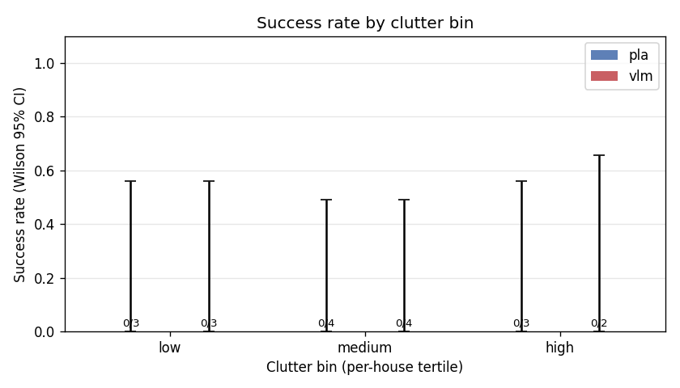
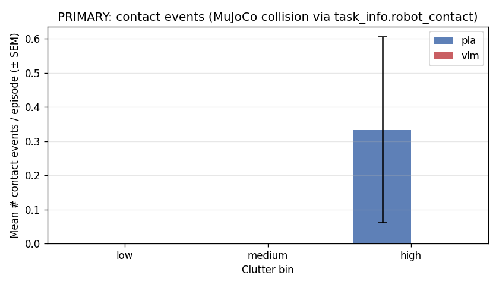
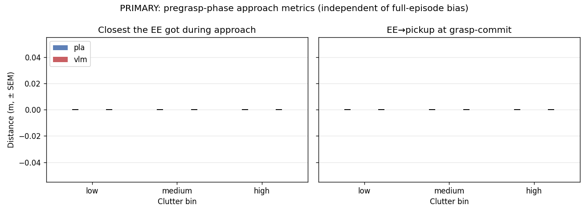
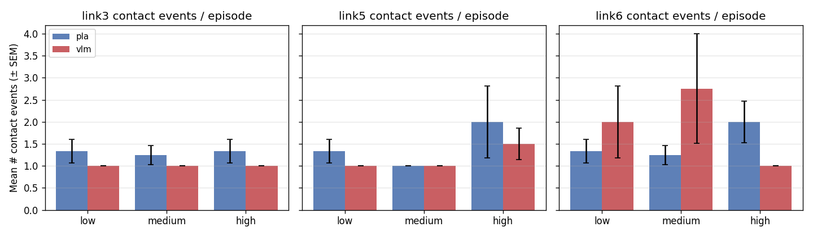
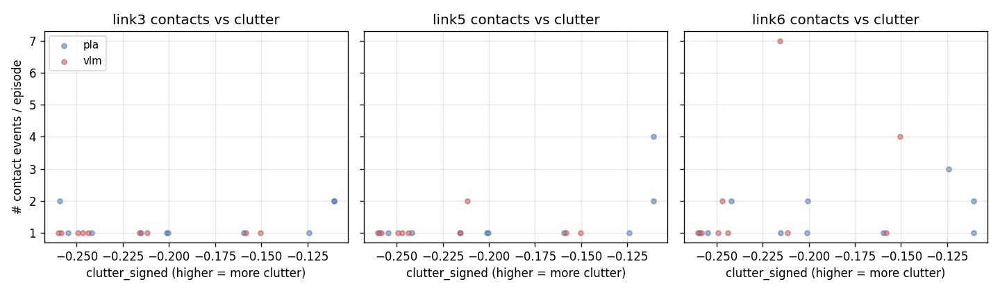
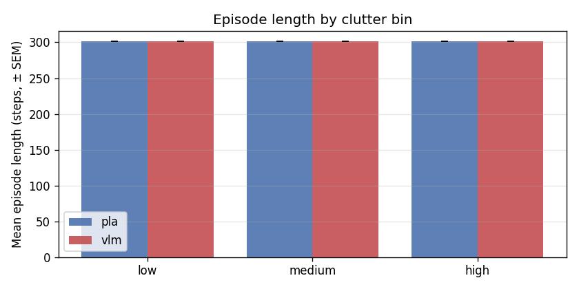
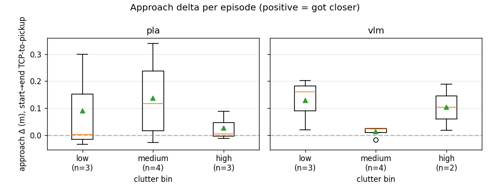
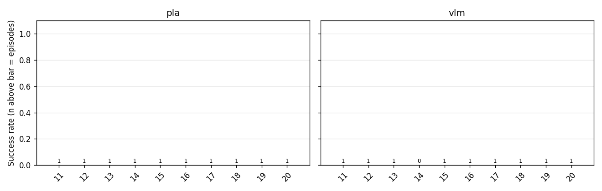

# Eval-harness report

- Models: pla, vlm
- Clutter bins: low, medium, high
- Total episodes: **19**

## Headline: success rate (Wilson 95% CI)

| Clutter bin | pla (n / sr [lo, hi]) | vlm (n / sr [lo, hi]) |
|---|---|---|
| low | 0/3  0.0%  [0.00, 0.56] | 0/3  0.0%  [0.00, 0.56] |
| medium | 0/4  0.0%  [0.00, 0.49] | 0/4  0.0%  [0.00, 0.49] |
| high | 0/3  0.0%  [0.00, 0.56] | 0/2  0.0%  [0.00, 0.66] |

**All bins pooled:**

| Model | n | success | success rate | Wilson 95% CI |
|---|---|---|---|---|
| pla | 10 | 0 | 0.0% | [0.00, 0.28] |
| vlm | 9 | 0 | 0.0% | [0.00, 0.30] |

## PRIMARY contact metric (task_info.robot_contact, MuJoCo collision)

This is the headline mechanism number. Independent of the policy's proximity input, so the comparison is non-tautological.

| Model | Bin | Mean # contact events / ep | Mean # contact frames / ep |
|---|---|---|---|
| pla | low | 0.00 ± 0.00 | 0.0 |
| pla | medium | 0.00 ± 0.00 | 0.0 |
| pla | high | 0.33 ± 0.27 | 22.7 |
| vlm | low | 0.00 ± 0.00 | 0.0 |
| vlm | medium | 0.00 ± 0.00 | 0.0 |
| vlm | high | 0.00 ± 0.00 | 0.0 |

## PRIMARY approach metric (pregrasp-phase TCP→pickup)

Measured only during `policy_phase == pregrasp`. `pregrasp_min` is the closest the EE got during the approach. `pregrasp_final` is the distance at the last pregrasp frame (i.e., at grasp commit).

| Model | Bin | pregrasp_min (m) | pregrasp_final (m) | pregrasp_progress (m) | n_with_pregrasp |
|---|---|---|---|---|---|
| pla | low | nan | nan | nan | 0/3 |
| pla | medium | nan | nan | nan | 0/4 |
| pla | high | nan | nan | nan | 0/3 |
| vlm | low | nan | nan | nan | 0/3 |
| vlm | medium | nan | nan | nan | 0/4 |
| vlm | high | nan | nan | nan | 0/2 |

## SECONDARY: per-link contact events / episode (mean ± SEM)

Diagnostic only — counts <5 cm proximity-reading dips. Same data the policy sees, so DO NOT use as the mechanism headline.

| Model | Bin | link3 | link5 | link6 |
|---|---|---|---|---|
| pla | low | 1.33 ± 0.27 | 1.33 ± 0.27 | 1.33 ± 0.27 |
| pla | medium | 1.25 ± 0.22 | 1.00 ± 0.00 | 1.25 ± 0.22 |
| pla | high | 1.33 ± 0.27 | 2.00 ± 0.82 | 2.00 ± 0.47 |
| vlm | low | 1.00 ± 0.00 | 1.00 ± 0.00 | 2.00 ± 0.82 |
| vlm | medium | 1.00 ± 0.00 | 1.00 ± 0.00 | 2.75 ± 1.24 |
| vlm | high | 1.00 ± 0.00 | 1.50 ± 0.35 | 1.00 ± 0.00 |

## Per-link near-contact frames / episode (mean)

| Model | Bin | link3 | link5 | link6 |
|---|---|---|---|---|
| pla | low | 6.3 | 2.3 | 62.3 |
| pla | medium | 1.2 | 1.0 | 1.2 |
| pla | high | 1.3 | 2.3 | 2.0 |
| vlm | low | 1.0 | 1.0 | 15.7 |
| vlm | medium | 1.0 | 1.0 | 2.8 |
| vlm | high | 1.0 | 1.5 | 1.0 |

## Per-house breakdown

| House | Clutter | pla (ok/n) | vlm (ok/n) |
|---|---|---|---|
| 11 | medium | 0/1 | 0/1 |
| 12 | medium | 0/1 | 0/1 |
| 13 | high | 0/1 | 0/1 |
| 14 | high | 0/1 | 0/0 |
| 15 | medium | 0/1 | 0/1 |
| 16 | low | 0/1 | 0/1 |
| 17 | low | 0/1 | 0/1 |
| 18 | high | 0/1 | 0/1 |
| 19 | low | 0/1 | 0/1 |
| 20 | medium | 0/1 | 0/1 |

## Plots

