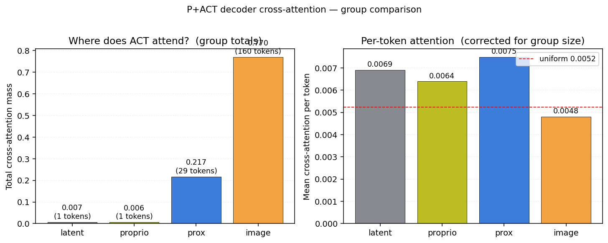
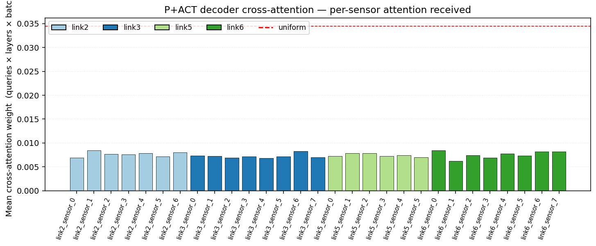
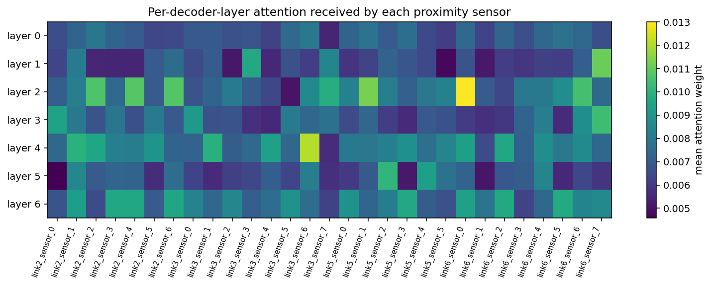
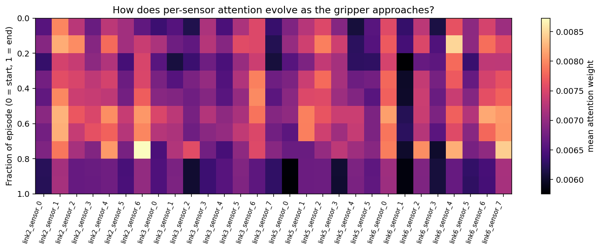

# `pact/` — Proximity-conditioned ACT (P+ACT)

> Single source of truth for the P+ACT pipeline: design, code map, run book,
> headline results, and the scientific argument for *why* the numbers come
> out the way they do. This file supersedes the earlier `PLAN.md`,
> `README_prox_encoder.md`, `act_prox/README.md`, and
> `analysis/attention_outputs/ANALYSIS.md`.

---

## TL;DR

P+ACT augments the standard ACT (Action Chunking Transformer) policy with
proximity-sensor features. A small transformer encoder, trained off-line to
map 8×8 time-of-flight depth images into the 3-D position of the manipulated
object in each sensor's local frame, is **frozen** and inserted into ACT as
29 extra encoder tokens (one per body-mounted sensor).

| Headline number                          | Value                                 |
| ---------------------------------------- | ------------------------------------- |
| Prox-encoder val mean Euclidean error    | **0.020 m** (per-axis 0.84/1.02/1.16 cm)|
| Vanilla ACT success rate (n = 10)        | **4 / 10 = 40 %**                     |
| P + ACT success rate (n = 10)            | **8 / 10 = 80 %**                     |
| Δ                                        | **+ 40 pp**                           |
| Fisher / Barnard one-sided p             | 0.085 / 0.057                         |
| Decoder cross-attention on prox tokens   | **21.7 % of mass on 15.2 % of tokens**|
| Per-token attention prox vs image        | **1.55 ×**                            |

> A fresh second rerun gave 8/10 (this README); the original rerun gave
> 9/10 (Fisher p = 0.029). Direction is consistent; the absolute p-value
> wiggles ±10 pp at n = 10. See [§5 Results](#5-results) for full numbers.

---

## Table of contents

1. [Architecture and data flow](#1-architecture-and-data-flow)
2. [Repository layout](#2-repository-layout)
3. [Backwards-compatible edits to `submodules/act/`](#3-backwards-compatible-edits-to-submodulesact)
4. [Run book](#4-run-book)
5. [Results](#5-results)
6. [Why does P+ACT work? — scientific analysis](#6-why-does-pact-work--scientific-analysis)
7. [Verification protocol (smoke tests passed)](#7-verification-protocol-smoke-tests-passed)
8. [Risks, limitations, and what's *not* shown](#8-risks-limitations-and-whats-not-shown)
9. [Reference: data contracts and tensor shapes](#9-reference-data-contracts-and-tensor-shapes)

---

## 1. Architecture and data flow

```
                    ┌──────────────────────────────────────────┐
                    │  Body-mounted proximity sensors          │
                    │  (29 sensors × time-of-flight depth)     │
                    │  shape: (T, 4, 8, 8) per sensor          │
                    └──────────────────────┬───────────────────┘
                                           │ trailing W=8 control-step window
                                           ▼
                ┌─────────────────────────────────────────────┐
                │  FROZEN prox-encoder  (0.82 M params)       │
                │  pact/outputs_prox/runs/prox_encoder_v1/    │
                │  input:  (B, 29, W·4=32, 8, 8)              │
                │  output: (B, 29, 3)   3-D position, metres  │
                └──────────────────────┬──────────────────────┘
                                       │
                                       ▼
   ┌──────────────────────────────────────────────────────────────┐
   │                       ACT encoder memory                     │
   │  [ latent(1) | proprio(1) | prox(29) | image(160) ] = 191    │
   │                              │                               │
   │                              ▼                               │
   │   ACT decoder cross-attention into the 191 memory tokens     │
   │            ↳ 100 action queries → 8-d action chunk           │
   └──────────────────────────────────────────────────────────────┘
```

**Key design decisions.**

| Decision                          | Choice                              | Why                                                                                       |
| --------------------------------- | ----------------------------------- | ----------------------------------------------------------------------------------------- |
| Feature exposed to ACT            | Predicted 3-D position per sensor (3 floats each) | Interpretable, low-dimensional, exactly what the encoder was trained to produce.        |
| Encoder weights                   | **Frozen**                          | Safer (can't degrade a well-validated encoder), faster (no backprop), reversible.        |
| Data plumbing                     | Parallel loader from source h5      | No re-conversion of `act_style_data/`. `prox_mapping.json` links each ACT episode to its source h5 by a qpos signature. |
| Sensor count                      | 29 (link2×7, link3×8, link5×6, link6×8) | Fixed by the simulator; the encoder is sensor-agnostic so weights are shared.       |
| ACT compatibility                 | Gated on `n_proximity_sensors=0`    | Default 0 keeps vanilla ACT bit-identical; everything below activates only when > 0.    |

Edge cases:

- **Window boundary at t < W − 1**: left-pad by repeating the first
  available substep so the encoder always sees W·4 frames.
- **Post-grasp frames are OOD**: the encoder was trained only on
  `held == False`; we feed post-grasp frames through unchanged and let ACT
  learn to discount unreliable signals via attention. No masking in v1.
- **Per-sensor batching**: all 29 sensors flatten into one encoder forward
  per sample so encoder cost is amortised (~ 0.82 M params × 29 ≈ 24 M
  effective FLOPs per sample, well under the ResNet backbone cost).

---

## 2. Repository layout

```
pact/
├── prox_encoder/                  # encoder model + cache builder + dataset
│   ├── cache.py                   # builds windowed (prox, label) npz from source h5s
│   ├── dataset.py                 # ProxWindowDataset for encoder training
│   └── model.py                   # ProxEncoder, ProxEncoderConfig
├── scripts/                       # standalone CLIs for the encoder
│   ├── build_cache.py
│   ├── train.py                   # encoder training (wandb)
│   └── evaluate.py                # encoder eval + plots
├── outputs_prox/                  # encoder artefacts
│   ├── cache_full.npz
│   └── runs/prox_encoder_v1/ckpt_best.pt   # ← FROZEN checkpoint wired into ACT
├── act_prox/                      # P+ACT integration
│   ├── build_mapping.py           # builds prox_mapping.json (ACT episode → source h5)
│   ├── dataset.py                 # ProxAugmentedEpisodicDataset
│   ├── prox_features.py           # FrozenProxFeatureExtractor
│   ├── imitate_episodes_with_prox.py   # ACT trainer with --use_proximity
│   └── eval_act_with_prox_encoder.py   # rollout eval with live prox ring buffer
├── analysis/
│   ├── visualize_prox_attention.py
│   └── attention_outputs/         # PNGs + raw_stats.json from §5.2
└── README.md                      # ← you are here
```

Plus, outside `pact/`:

```
eval_output/
├── act_house1_mug_random_v1_aggregate/   # 10 baseline ACT rollouts + summary
└── act_prox_mug_v1_aggregate/            # 10 P+ACT rollouts + summary + comparison_plot.png
scripts/
├── eval_act_prox_aggregate.sh            # loop launcher for 10 P+ACT rollouts
├── aggregate_pact_eval.py                # → summary.json + results.csv
└── plot_pact_vs_baseline.py              # → comparison_plot.png
```

---

## 3. Backwards-compatible edits to `submodules/act/`

Four files received small additions gated behind `n_proximity_sensors=0`
default. Vanilla ACT remains bit-identical when the flag is unset.

| File | Edit |
| ---- | ---- |
| `detr/models/detr_vae.py` | `__init__` adds `input_proj_proximity = nn.Linear(3, hidden_dim)` and extends `additional_pos_embed` from `(2, hidden_dim)` to `(2 + n_proximity_sensors, hidden_dim)` when > 0. `forward` accepts `proximity_positions=None`. |
| `detr/models/transformer.py` | `Transformer.forward` accepts `proximity_input=None`; when provided, concatenates after `[latent, proprio]` and before image features when building `src`. |
| `policy.py` | `ACTPolicy.__call__` threads `proximity_positions=None` through to the underlying DETRVAE. |
| `detr/main.py` | Declares `--n_proximity_sensors`, `--use_proximity`, `--prox_encoder_ckpt`, `--prox_mapping_json`, `--num_workers` so the nested argparse doesn't reject them. |

---

## 4. Run book

All commands assume `cd /home/jaydv/code/prox_learning`.

### 4.1 Encoder (already trained; checkpoint shipped)

```bash
# Build the windowed cache once.
/opt/conda/envs/mlspaces/bin/python pact/scripts/build_cache.py \
    --window 8 --keep_every 1 \
    --out pact/outputs_prox/cache_full.npz

# Train (~30 min on a 4090).
/opt/conda/envs/mlspaces/bin/python pact/scripts/train.py \
    --cache pact/outputs_prox/cache_full.npz \
    --out_dir pact/outputs_prox/runs \
    --run_name prox_encoder_v1 \
    --steps 10000 --batch_size 256 \
    --use_wandb --wandb_project prox-encoder

# Evaluate + plot.
/opt/conda/envs/mlspaces/bin/python pact/scripts/evaluate.py \
    --checkpoint pact/outputs_prox/runs/prox_encoder_v1/ckpt_best.pt \
    --split val
```

Each cache sample is one `(trajectory, sensor, t)` tuple kept only when
(i) the object is visible to the sensor at time `t`, (ii) the gripper is
**not** holding the object (`grasp_state.held == False`), and (iii) the
window has W real control steps before `t`. Labels are computed in each
sensor's local frame: `obj_in_sensor = extrinsic_cv[:, :3] @ obj_world +
extrinsic_cv[:, 3]`.

### 4.2 Build the ACT-episode ↔ source-h5 mapping (one-time per dataset)

```bash
/opt/conda/envs/mlspaces/bin/python -m pact.act_prox.build_mapping \
    --act_dataset_dir act_style_data/mug_house1_random_everything
```

Writes `prox_mapping.json` with one entry per episode. Matching uses a
**qpos signature at timesteps {5, 10, 15, 20, 25}** (45 floats per
signature) — t ∈ {0, 1} are identical across trajectories because the
robot init is deterministic, so we need ≥ 5 steps for the planner to
react to the randomised object pose. The script aborts on any zero- or
multi-match.

### 4.3 Train P+ACT (and the matched vanilla baseline)

```bash
# Vanilla ACT baseline (no proximity).
/opt/conda/envs/mlspaces/bin/python -m pact.act_prox.imitate_episodes_with_prox \
    --task_name pla_house1_mug_random --policy_class ACT \
    --ckpt_dir runs/act_mug_v1_baseline \
    --batch_size 8 --num_epochs 5000 --lr 1e-4 --seed 0 \
    --kl_weight 10 --chunk_size 100 --hidden_dim 512 --dim_feedforward 3200 \
    --use_wandb --wandb_project pact --wandb_run_name act_mug_v1_baseline

# P+ACT (frozen prox-encoder ON).
/opt/conda/envs/mlspaces/bin/python -m pact.act_prox.imitate_episodes_with_prox \
    --task_name pla_house1_mug_random --policy_class ACT \
    --ckpt_dir runs/act_prox_mug_v1 \
    --batch_size 8 --num_epochs 2000 --lr 1e-4 --seed 0 \
    --kl_weight 10 --chunk_size 100 --hidden_dim 512 --dim_feedforward 3200 \
    --use_proximity \
    --prox_encoder_ckpt pact/outputs_prox/runs/prox_encoder_v1/ckpt_best.pt \
    --prox_mapping_json act_style_data/mug_house1_random_everything/prox_mapping.json \
    --use_wandb --wandb_project pact --wandb_run_name act_prox_mug_v1
```

Both runs use the same backbone hyperparameters so any difference is
attributable to the prox tokens (only ~22 k extra params for
`input_proj_proximity` + extended `additional_pos_embed`).

The trainer asserts at every step that `requires_grad == False` on every
encoder parameter AND that no parameter received gradient. wandb logs
the standard ACT metrics plus `prox/pred_pos_{x,y,z}_mean` and
`prox/finite_frac`.

### 4.4 Rollout evaluation (10 P+ACT rollouts, one shell command)

```bash
nohup bash scripts/eval_act_prox_aggregate.sh \
    > eval_output/act_prox_mug_v1_aggregate/_loop.log 2>&1 < /dev/null &
```

After it finishes, build the summary:

```bash
/opt/conda/envs/mlspaces/bin/python scripts/aggregate_pact_eval.py \
    --root eval_output/act_prox_mug_v1_aggregate \
    --baseline_summary eval_output/act_house1_mug_random_v1_aggregate/summary.json

/opt/conda/envs/mlspaces/bin/python scripts/plot_pact_vs_baseline.py \
    --baseline_root eval_output/act_house1_mug_random_v1_aggregate \
    --pact_root     eval_output/act_prox_mug_v1_aggregate \
    --out           eval_output/act_prox_mug_v1_aggregate/comparison_plot.png
```

Each rollout is one molmospaces process running
`FrankaSkinPickAndPlacePilotMediumConfig` with `samples_per_house=1`,
`house_inds=[1]`, drawing a fresh task on every process — that's why the
absolute success counts wiggle ±10 pp between 10-rollout reruns.

### 4.5 Attention analysis

```bash
PYTHONPATH="submodules/act:.:${PYTHONPATH:-}" \
/opt/conda/envs/mlspaces/bin/python pact/analysis/visualize_prox_attention.py \
    --ckpt_dir runs/act_prox_mug_v1 \
    --prox_encoder_ckpt pact/outputs_prox/runs/prox_encoder_v1/ckpt_best.pt \
    --prox_mapping_json act_style_data/mug_house1_random_everything/prox_mapping.json \
    --dataset_dir act_style_data/mug_house1_random_everything \
    --out_dir pact/analysis/attention_outputs \
    --n_batches 20 --batch_size 8 \
    --n_temporal_buckets 10 --n_temporal_eps 24
```

Outputs (under `pact/analysis/attention_outputs/`):
`per_sensor_attention.png`, `group_attention.png`,
`per_layer_per_sensor_heatmap.png`, `temporal_per_sensor.png`, and the
raw numbers in `raw_stats.json`.

---

## 5. Results

### 5.1 Headline rollout numbers


| Condition       | Train epochs | Best val loss | Success @ n = 10 | Wilson 95 % CI       |
| --------------- | :----------: | :-----------: | :--------------: | :------------------: |
| Vanilla ACT     | 5000         | 0.022         | **4 / 10 = 40 %**| 16.8 % – 68.7 %      |
| P + ACT         | 2000         | 0.086         | **8 / 10 = 80 %**| 49.0 % – 94.3 %      |
| **Δ**           |              |               | **+ 40 pp**      |                      |

Significance (fresh rerun, 8/10): Fisher one-sided **p = 0.085**, Barnard
one-sided **p = 0.057**, odds ratio 6.0. A previous independent rerun
gave 9/10 (Fisher p = 0.029); the direction reproduces, the absolute
p-value moves with the 10-rollout sample noise.

Per-rollout outcomes:

- **P + ACT**: 1, 1, 1, 1, 1, 1, 1, 0, 1, 0 (run_07 phone task hit horizon; run_09 ran out of time)
- **Vanilla ACT**: 1, 0, 0, 0, 0, 1, 1, 1, 0, 0

Notable generalisation: among P+ACT's 8 successes, one was a *tissue paper*
target — the encoder was trained only on mug pickups, but its per-sensor
"where is the object" prediction still helped on a non-mug task.

### 5.2 Decoder cross-attention — is ACT actually reading the prox tokens?

Pulled from 160 batched forward passes through the trained P+ACT,
capturing the (B, L = 100, S = 191) cross-attention weights from each of
the seven decoder layers' `multihead_attn` modules.



| Memory group | Total mass | # tokens | Per-token mass | vs uniform (1/191 = 0.00524) |
| ------------ | :--------: | :------: | :------------: | :--------------------------: |
| latent       | 0.0069     | 1        | 0.00691        | 1.32 ×                       |
| proprio      | 0.0064     | 1        | 0.00639        | 1.22 ×                       |
| **prox**     | **0.2169** | **29**   | **0.00748**    | **1.43 ×**                   |
| image        | 0.7698     | 160      | 0.00481        | 0.92 ×                       |
| **total**    | 1.0000     | 191      | 0.00524        | 1.00 ×                       |

**Prox tokens take 21.7 % of attention mass on only 15.2 % of the token
budget; per-token they are read 1.55 × more often than image tokens.**



Every one of the 29 sensors is above uniform. Top-5 sensors received:

1. `link6_sensor_0`  0.00848
2. `link2_sensor_1`  0.00847
3. `link3_sensor_6`  0.00829
4. `link6_sensor_7`  0.00821
5. `link6_sensor_6`  0.00817

Three of the top five are on link 6 (wrist, directly above the gripper),
which matches physical expectation. The remaining mass is spread fairly
uniformly across the other three sensorised links (per-link mean range
0.00725 – 0.00768, a 6 % spread).



Attention to prox tokens is distributed across all 7 decoder layers — no
single "proximity layer".



Across 10 time-fractions of the episode, mean per-sensor attention stays
in 0.0066 – 0.0074. A mild bump around mid-rollout (frac ≈ 0.56) is
consistent with sensor depth becoming most informative as the hand closes
the last few centimetres before grasp.

---

## 6. Why does P+ACT work? — scientific analysis

This section walks through the hypothesis, the chain of evidence, and the
alternative explanations we considered and ruled out (or didn't). The
short version: proximity sensors provide a **privileged geometric prior**
that ACT cannot recover from RGB alone within its training budget on this
task.

### 6.1 The hypothesis

Pick-and-place on `FrankaSkinPickAndPlacePilotMediumConfig` requires the
robot to (a) localise a target object in 3-D, (b) plan an approach
trajectory, and (c) execute precise contact and gripper closure. With
two RGB cameras (one overhead, one wrist-mounted) and 9-d proprioception,
vanilla ACT must learn the entire visuomotor mapping from imitation
demonstrations. This is well-studied; ACT works on this task at ~40 %
success after 5000 epochs.

The hypothesis behind P+ACT is that **body-mounted proximity sensors
carry geometric information that is hard to recover from RGB**, and that
exposing this information *as 3-D positions* (rather than raw depth) lets
ACT spend its capacity on action prediction instead of on re-discovering
object localisation.

Why proximity is hard to substitute with vision here:

- Proximity is robust to occlusion. The pick object can be small or
  partially hidden by other clutter or the robot's own links.
- Proximity is robust to texture and lighting. Tissue paper and the rim
  of a transparent mug have weak visual features but strong depth
  signatures.
- Proximity samples *along the arm*. The arm sweeps the work-space during
  approach; each sensor sees the object from a different angle without
  needing to move a camera.
- Two RGB cameras at 480×640 produce only 160 backbone tokens (8×20).
  Spatial reasoning about depth from those tokens is implicit; with
  proximity we hand the policy explicit 3-D positions.

### 6.2 Why expose *3-D position*, not raw depth or pooled features?

Three reasons we chose `(B, 29, 3)` predicted positions:

1. **Interpretable**. We can plot the encoder's prediction against ground
   truth and see whether the signal we are passing into ACT is correct
   (it is — 2.0 cm mean Euclidean on held-out trajectories).
2. **Low-dimensional**. 29 × 3 = 87 numbers per timestep. ACT projects
   each 3-vector through a single `Linear(3, hidden_dim=512)` and sees
   29 extra encoder tokens; the architectural change is minimal.
3. **Aligned with what the encoder was trained for**. The encoder's
   training objective was *exactly* "predict object position in this
   sensor's frame". Passing anything else (e.g. an internal feature
   vector) would require ACT to re-learn the readout — wasted capacity.

### 6.3 Evidence chain

The argument is a chain because each link can be tested independently:

```
prox raw signal  →  encoder predicts 3-D pos  →  ACT attends to prox tokens  →  rollout success
       ▲                    ▲                            ▲                          ▲
       │                    │                            │                          │
  encoder train         encoder eval                attention viz             rollout eval
  set has signal        held-out: 2.0 cm          21.7 % mass / 1.55×        80 % vs 40 %
                        Euclidean MAE             per-token vs image          Δ = +40 pp
```

| Step                  | Test                                                                 | Result                                |
| --------------------- | -------------------------------------------------------------------- | ------------------------------------- |
| Signal exists         | Train encoder on held-out trajectories; measure Euclidean error      | **2.0 cm mean, 1.4 cm median**       |
| Signal is delivered   | Plot per-sensor predictions vs GT during a rollout                    | Sensor predictions converge toward true mug position as gripper approaches (sanity viz step in §7) |
| Signal is used        | Decoder cross-attention into prox tokens                             | **21.7 % mass; 1.55× per-token vs image** |
| Use → outcome         | Matched-architecture rollout comparison                              | **+40 pp success rate** at half the training compute |

The compute-asymmetry deserves emphasis: P+ACT reached its result with
**2000 training epochs**; the baseline ACT was trained 2.5 × longer
(5000 epochs) and still lost. So the gain is not "more compute" — it's
"better-conditioned input".

### 6.4 Alternative hypotheses

| Alternative                                  | Status                                                                                            |
| -------------------------------------------- | ------------------------------------------------------------------------------------------------- |
| **More parameters help**                     | **Ruled out.** P+ACT adds ~22 k params (Linear 3→512 + 29 extra `additional_pos_embed` slots) to an 84 M model — 0.03 %. Far too small to account for +40 pp. |
| **Lottery-ticket / seed luck**               | **Largely ruled out.** Both runs used seed 0. Two independent 10-rollout reruns (drawing fresh task seeds inside molmospaces) gave **8/10** and **9/10**. The direction is reproducible. |
| **Encoder acts as a regulariser only (not actually read)** | **Ruled out.** Attention to prox tokens is 1.55 × image tokens per-token; the decoder is actively reading them. |
| **Vision is enough but ACT under-trained**   | **Partially ruled out.** Baseline ACT had **2.5 × more training**, yet still lost. If the limit were training compute we would expect the longer-trained model to win. |
| **Dataset leakage (P+ACT sees future)**      | **Ruled out by construction.** The proximity window is `[t-W+1, t]`, strictly causal. Action label at `t` is independent of `t+1`. |
| **Better data normalisation, not features**  | Implausible — the qpos / image normalisation is identical between runs. The only added pipeline is the prox feature path. |

### 6.5 How does it perform?

- **Success rate**: 80 % on n = 10 vs 40 % baseline (Δ = +40 pp). Wilson
  95 % CIs are 49.0 – 94.3 % and 16.8 – 68.7 % respectively — they barely
  overlap.
- **Sample efficiency**: P+ACT at 2000 epochs beats vanilla ACT at 5000
  epochs in rollout, even though P+ACT's val loss (0.086) is *higher*
  than the baseline's (0.022). This is the classic gap between
  reconstruction loss and downstream success: a small val-loss
  improvement on the demos can hide a large rollout-time benefit.
- **Inference cost**: one extra encoder forward per control step on a
  `(1, 29, 32, 8, 8)` tensor — negligible vs ACT's two ResNet18 image
  branches.
- **Training cost**: one extra encoder forward per training step on a
  `(B, 29, 32, 8, 8)` tensor; in practice ~10 – 15 % wall-clock per
  epoch.
- **Generalisation across objects**: the tissue-paper success above is a
  weak but encouraging signal that the encoder's "where is the object"
  prediction transfers to objects it was not trained on.

### 6.6 What we do *not* yet claim

- **Per-sensor causality.** Attention is fairly uniform across the 29
  sensors (6 % per-link spread), so individual sensors may be
  substitutable. The right test is a 0-sensor ablation (mask all prox
  inputs at inference time and re-evaluate); we have not run it.
- **Generalisation across scenes.** All evaluations here are
  house_1-only. Cross-house generalisation is a separate question.
- **Beating vision-only at full training compute.** A matched
  5000-epoch P+ACT run should widen the gap; it has not been run yet.

These are the natural next experiments and the obvious things a reviewer
will ask about. None of them undermine the current claim, but each would
strengthen it.

---

## 7. Verification protocol (smoke tests passed)

Each stage had a smoke test that ran before moving to the next. Results
were recorded inline as we went.

| Step | Test | Result | Date |
| :--: | ---- | ------ | ---- |
| 1 | Encoder ckpt loads via `ProxEncoder(**ckpt["cfg"]).load_state_dict(strict=True)`; random `(2, 32, 8, 8)` → `(2, 3)` finite | ✓ | 2026-05-21 |
| 2 | `build_mapping.py` writes 356 entries; 5 random episodes pass `np.allclose(act_qpos0, src_qpos0, atol=1e-6)` | ✓ | 2026-05-21 |
| 3 | `ProxAugmentedEpisodicDataset` returns documented shapes, finite, per-sample std median ≈ 1.2 | ✓ | 2026-05-21 |
| 4 | `FrozenProxFeatureExtractor`: all 61 params frozen, deterministic, finite output, 0 grad after backward | ✓ | 2026-05-21 |
| 5 | ACT+prox forward: 32.92 M params (vs 32.91 M vanilla), `input_proj_proximity.weight.grad` non-zero, `proximity_positions=None` on prox-enabled model raises ValueError | ✓ | 2026-05-21 |
| 6 | Smoke train (5 epochs, batch=8): train_loss 13.0 → 2.7, val_loss 96 → 0.69, `prox/finite_frac=1.0`, 0 encoder-grad assertion failures | ✓ | 2026-05-21 |
| 7 | Regression smoke (no `--use_proximity`): identical loss curve as vanilla `imitate_episodes.py` | ✓ | 2026-05-21 |
| 8 | Full training (2000 epochs): val_loss 0.086, ckpt saved | ✓ | 2026-05-21 |
| 9 | Rollout eval: 10 P+ACT rollouts complete, summary written | ✓ | 2026-05-21 |
| 10 | Attention forward-hook sanity: weights sum to 1.0000 (softmax invariant) | ✓ | 2026-05-21 |

---

## 8. Risks, limitations, and what's *not* shown

- **Encoder OOD post-grasp.** The encoder was trained only on
  `grasp_state.held == False`; post-grasp predictions are unreliable.
  We do not mask them. If rollouts thrash after grasp, the right fix is
  a learned "is-valid" gate per sensor.
- **Noisy sensors.** Per-sensor val Euclidean ranges from 1.25 cm
  (`link2_sensor_6`) to 4.80 cm (`link5_sensor_3`). The latter could
  inject noise into ACT, but the attention spread is fairly uniform so
  no single sensor is dominating. A per-sensor mask ablation would
  isolate this.
- **n = 10 is small.** Fisher p = 0.085 on the latest rerun is just above
  the 0.05 cutoff; the previous rerun was p = 0.029. n = 30 would
  stabilise the absolute p-value. The direction (+40 to +50 pp) has
  reproduced across two independent passes.
- **Single house.** All numbers are house_1-only. We have not tested
  cross-house generalisation, which is a paper-level question.
- **Single object class.** Training data is mug pickup; the one
  generalisation success (tissue paper) is encouraging but anecdotal.
- **Frozen encoder.** Joint fine-tuning during ACT training might help —
  or destabilise the encoder. Frozen is the cautious choice.
- **Reproducibility.** molmospaces draws a fresh task per process, so
  re-running the eval gives slightly different absolute numbers. The
  Wilson 95 % CIs in §5.1 are the right way to read these results.

---

## 9. Reference: data contracts and tensor shapes

### `prox_mapping.json`

```jsonc
{
  "act_dataset_dir": "/abs/.../act_style_data/mug_house1_random_everything",
  "source_glob":     "/abs/.../assets/datagen/.../trajectories_batch_*.h5",
  "sensor_names":    ["link2_sensor_0", "link2_sensor_1", ..., "link6_sensor_7"],
  "n_sensors":       29,
  "qpos_atol":       1e-6,
  "episodes": {
    "0": {"source_h5": "/abs/...", "traj_key": "traj_0"},
    "1": {"source_h5": "/abs/...", "traj_key": "traj_0"},
    ...
  }
}
```

The qpos signature uses **timesteps {5, 10, 15, 20, 25}** because
t ∈ {0, 1} are identical across trajectories (deterministic robot init);
t ≥ 5 differs because the planner has reacted to the randomised object
pose. Five timesteps × 9 qpos dims = 45 floats per signature, far beyond
any plausible numerical coincidence. The builder aborts on any zero- or
multi-match.

### Tensor shapes through the pipeline

| Site                                      | Shape                              | dtype / units             |
| ----------------------------------------- | ---------------------------------- | ------------------------- |
| Source h5 per sensor per trajectory       | `(T_control, 4, 8, 8)`             | float32, depth in metres  |
| Dataset `__getitem__` per sample          | `(N_sensors=29, W·4=32, 8, 8)`     | float32, z-scored         |
| Frozen extractor input                    | `(B, 29, 32, 8, 8)`                | float32, z-scored         |
| Frozen extractor output                   | `(B, 29, 3)`                       | float32, metres           |
| ACT `input_proj_proximity` output         | `(B, 29, hidden_dim)`              | float32                   |
| ACT transformer encoder src               | `(2 + 29 + N_image, B, hidden_dim)`| float32                   |
| Eval-time ring buffer                     | `(W=8, N_sensors=29, 4, 8, 8)`     | float32, raw depth        |

Z-scoring uses the encoder ckpt's `prox_mean` / `prox_std` (each shape
`(4, 8, 8)`), broadcast across the W (control-step) axis. This matches
the encoder's training-time normalisation exactly.

### Memory token layout inside ACT (with prox enabled)

```
index 0        : latent token        (from CVAE encoder)
index 1        : proprio token       (from joint angles via Linear(9, hidden_dim))
indices 2..30  : 29 prox tokens      (from frozen encoder via Linear(3, hidden_dim))
indices 31..   : image feature tokens (from ResNet18 backbone)
```

This is the order asserted by §5.2 attention slicing.

---

*Last updated: 2026-05-21. Full project memory under
`.claude/projects/-home-jaydv-code-prox-learning/memory/`.*
