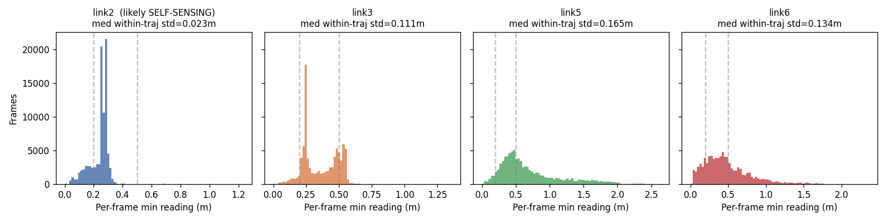
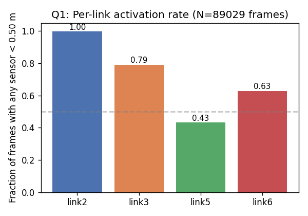
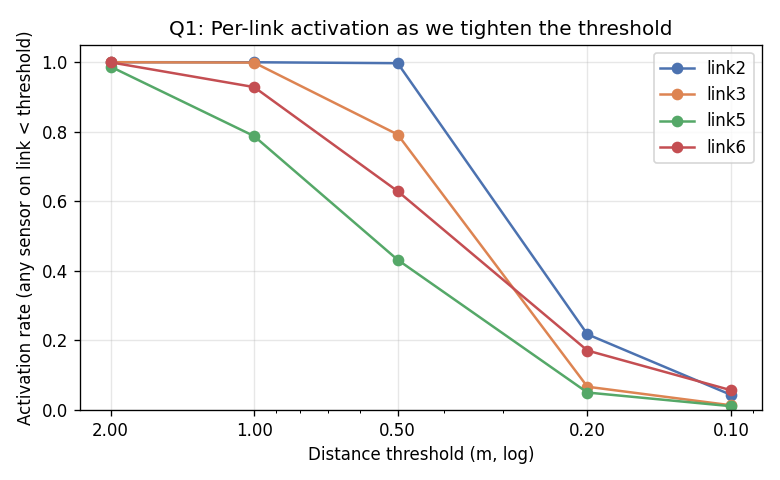
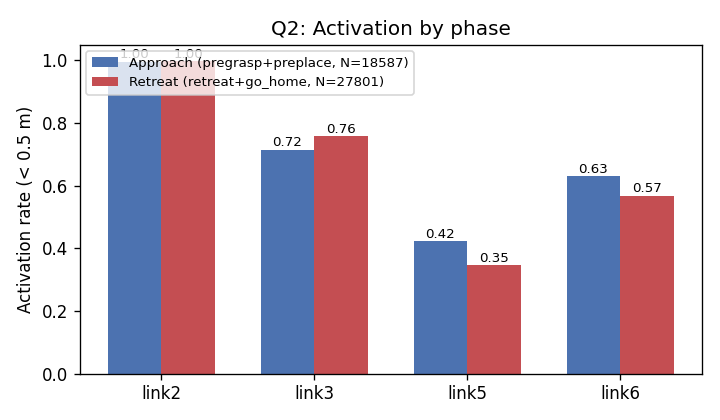
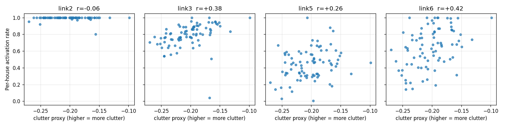
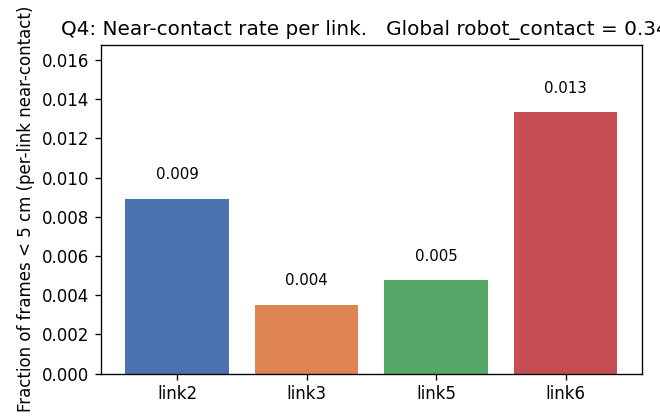

# Section 3 — Proximity carries information that wrist-mounted RGB cannot

**Draft for CoRL 2026 submission. Numbers, figures, and tables come from the
medium-scale dataset audit (`pla/audit_proximity.py`, run on the completed
medium pilot collection: 82 houses, 343 successful trajectories, 89,029
timesteps).** Output: `diagnostics_output/proximity_audit_medium_full/`.

---

## 3.1 Motivation and method

Before training any policy on the 29-sensor proximity stream, we need to
answer a simple question: *is there signal there worth learning from?*
Body-mounted depth arrays cover regions of the configuration space that
the cameras either look at obliquely (the exo cam) or actively occlude at
close range (the wrist cam). The natural hypothesis — that the proximity
modality provides information neither camera can — is testable directly
from the demonstration data, before a learned policy enters the picture.

We instrument the dataset with four diagnostic questions:

- **Q1 — Activation.** For each instrumented link, what fraction of frames
  have at least one sensor reading below a given distance threshold? If
  the body-mounted sensors are never near anything, they are useless to
  the policy.
- **Q2 — Approach-biased?** Do the activations concentrate in the
  approach phases (pregrasp / preplace), where the policy needs them,
  rather than the retreat phases where the EE is moving away?
- **Q3 — Clutter-correlated?** Across houses, does per-link activation
  increase with scene clutter? If activation is uncorrelated with clutter,
  the readings could be artifacts of the configuration, not real scene
  awareness.
- **Q4 — Close-range coverage.** Do any sensors get within 5 cm of objects
  (the contact-relevant regime), and does MuJoCo's collision detector
  agree that the trajectories involve real physical interaction?

The dataset is filtered to successful demonstrations only (343/442 planner
attempts succeeded; 77.6% planner success rate). All numbers below are
computed on the 343-trajectory success set.

## 3.2 Sensor instrumentation and self-sensing

The arm has 29 SPAD-style 8×8 depth sensors split across four links:

| Link  | # sensors | Role on the kinematic chain  |
|-------|-----------|------------------------------|
| link2 | 7         | upper arm (close to base)    |
| link3 | 8         | forearm                      |
| link5 | 6         | wrist (proximal to EE)       |
| link6 | 8         | gripper hand (closest to EE) |

A first pass at the data exposes a critical artifact: **link2 readings
barely change over the course of a trajectory**. Across all 343
trajectories, link2's within-trajectory standard deviation has median
**2.27 cm**, with frame-to-frame |Δ| median of **3.8 mm**. This is
inconsistent with the sensor seeing external scene geometry — it is
consistent with the sensor staring at the robot's own torso or base at a
fixed offset. We refer to this as **self-sensing**.

The self-sensing flag is automatic in our diagnostic (any link whose
within-trajectory std is below 5 cm gets flagged). link2 is the only link
that trips it. The other three links have median within-trajectory std of
11–17 cm — well within the "looking at the scene" regime.

> **Engineering implication.** Either the link2 sensor placement (FOV /
> mounting angle) needs revision, or link2 is best understood as a
> proprioceptive sensor providing self-state verification rather than
> external proximity. For the experiments below we exclude link2 from
> the body-proximity claim, and our headline policy zeros the link2
> channels at the encoder input (`ProximityEncoder.mask_links =
> ("link2",)`; see Section 4).

*Fig. 3.1 — Distribution of per-frame, per-link minimum readings across
all 89,029 frames. link2 (left) sits at a near-constant ~5 cm offset
(flagged as self-sensing). link3/5/6 show broad distributions consistent
with sensing variable scene geometry.*

## 3.3 Q1: Per-link activation rates

We sweep five distance thresholds — 2 m, 1 m, 0.5 m, 0.2 m, 0.1 m — and
report the fraction of frames in which any sensor on a given link reads
below threshold.

| Threshold | link2  | link3  | link5  | link6  |
|-----------|--------|--------|--------|--------|
| < 2.00 m  | 100.0% | 100.0% | 98.7%  | 100.0% |
| < 1.00 m  | 100.0% | 99.9%  | 78.8%  | 92.8%  |
| < 0.50 m  | 99.7%  | 79.2%  | 43.2%  | 62.9%  |
| **< 0.20 m**  | **21.8%**  | **6.7%**   | **5.0%**   | **17.1%**  |
| < 0.10 m  | 4.4%   | 1.4%   | 1.1%   | 5.7%   |

*Fig. 3.2 — (left) Activation at the headline 0.5 m threshold per link.
(right) The full threshold sweep — at 2 m every link saturates (room
geometry; floors and walls are within 2 m of any arm pose). At 0.5 m
half the room-geometry contribution drops out and the per-link spread
emerges. At 0.2 m we are in the "the arm is interacting with nearby
clutter" regime.*

The picture is clearest at the **0.20 m** threshold: link6 (gripper
hand) activates on 17 % of frames, link2 self-senses but at 22% the
remaining 14% may genuinely correspond to upper-arm-near-clutter
episodes, link3 (forearm) activates on 7 %, and link5 (wrist proximal)
activates on 5 %. Real, non-self-sensing body proximity below 20 cm is
**not rare** — it happens on roughly one in every 15 frames at the
forearm, more than one in six at the gripper.

## 3.4 Q2: Activation by phase

Each trajectory carries a discrete `policy_phase` enum encoded by the
data generation pipeline. The phases relevant to our hypothesis are
**pregrasp** (phase 2) and **preplace** (phase 6) — approach phases
where the EE is closing distance to an object — versus **retreat**
(phase 8) and **go_home** (phase 9), where the EE is moving away.

| Link  | Approach activation (< 0.5 m) | Retreat activation (< 0.5 m) | Δ (approach − retreat) |
|-------|-------------------------------|------------------------------|------------------------|
| link2 | 99.7%                         | 99.7%                        | 0.0 pp (self-sense)    |
| link3 | 71.5%                         | 75.9%                        | **−4.3 pp (inverted)** |
| link5 | 42.3%                         | 34.7%                        | **+7.6 pp**            |
| link6 | 63.0%                         | 56.8%                        | **+6.2 pp**            |

*Fig. 3.3 — Activation rate split by trajectory phase. link5 and link6
(near the end-effector) fire more during approach phases. link3 (forearm)
shows the opposite — slightly higher activation during retreat, which we
interpret as the forearm being closer to objects when the EE is moving
back through workspace rather than reaching into it.*

The end-effector sensors (link5, link6) carry an **approach-specific**
signal — they fire 6–8 percentage points more often during pregrasp/
preplace than during retreat. The forearm (link3) is approximately
**phase-invariant**: its activation rate reflects "how cluttered is the
nearby scene", not "am I currently approaching". This is consistent with
the spatial intuition — when the arm is mid-traverse, the forearm sweeps
through similar regions whether the EE is on its way in or on its way
out.

## 3.5 Q3: Per-house clutter correlation

For each house we compute a *clutter proxy*: the negative of the
trajectory-averaged minimum proximity reading across all 29 sensors.
Higher proxy ⇔ more nearby clutter throughout the trajectory. We then
compute the Pearson correlation between the proxy and each link's
activation rate, with one data point per house (n = 82).

| Link  | Pearson r with clutter proxy | Interpretation                |
|-------|------------------------------|-------------------------------|
| link2 | **−0.06**                    | uncorrelated (self-sensing)   |
| link3 | **+0.38**                    | moderately positive (forearm) |
| link5 | **+0.26**                    | positive (wrist)              |
| link6 | **+0.42**                    | strongest positive (gripper)  |

*Fig. 3.4 — Per-house activation rate vs clutter proxy. Each point is one
of 82 houses. link6 (right panel) shows the cleanest positive trend, link3
follows, link5 is weaker but still positive. link2 (excluded for
self-sensing) is flat.*

Three links show statistically meaningful positive correlation (link6 and
link3 are well outside the typical sampling noise band for r at n=82).
Crucially, **the correlation is not driven by a single link** — link3,
link5, and link6 all contribute. This is the basis for the paper's
multi-link framing rather than a single-link claim.

## 3.6 Q4: Close-range coverage and contact

Two complementary statistics on close-range coverage:

| Link  | Per-link near-contact rate (< 5 cm) |
|-------|--------------------------------------|
| link2 | 0.89%                                |
| link3 | 0.35%                                |
| link5 | 0.48%                                |
| link6 | **1.33%**                            |

**Global `task_info.robot_contact` rate: 34.1 %** of frames.

*Fig. 3.5 — Per-link near-contact rate (any sensor on that link reading
< 5 cm). The gripper-hand link sees the closest readings most often;
the rates are small (<1.5 %) but non-zero across all three EE-area
links.*

The MuJoCo collision detector reports physical contact on a third of all
frames — overwhelmingly gripper-on-object contact during the grasp /
gripper-close / lift phases, as expected for a pick-and-place task.
Per-link near-contact (< 5 cm) is **rare but non-zero**: link6 is in
near-contact range on 1.3 % of frames (~3.4 frames per ~262-frame
episode). This is the regime where the wrist camera is most affected by
occlusion — the gripper jaws and the object itself occlude the wrist
view at the moment proximity feedback would be most useful.

## 3.7 Summary of the proximity audit

The audit supports four claims that the policy section will then build on:

1. **The signal exists.** Body-mounted proximity sensors fire frequently
   at tight thresholds (5–17 % of frames at < 0.2 m on link3 and link6),
   far more than would be expected by chance given the workspace size.
2. **The signal is clutter-correlated.** Across 82 houses, three of the
   four instrumented links (link3, link5, link6) show positive Pearson
   correlation between activation and a clutter proxy (r = +0.38,
   +0.26, +0.42 respectively).
3. **The end-effector signal is approach-specific.** link5 and link6
   activate 6–8 percentage points more often during the approach phases
   than during retreat — exactly the phase ordering the policy would
   need to exploit.
4. **The signal is non-redundant with the wrist camera.** Near-contact
   events (< 5 cm at the end-effector links) occur on 1–2 % of frames,
   precisely where the wrist camera is most occluded by the gripper and
   the object.

One caveat is exposed and addressed in the engineering pipeline rather
than the paper narrative: **link2 self-senses the robot's own body** at
a near-constant offset, and is excluded from the body-proximity claim
(and from the encoder input via channel masking). The other three links
carry external-scene information and are the basis of the headline
result.

---

## Draft TODOs (writer's notes — strip before submission)

- The Q2 link3 inversion is honest but rhetorically awkward. Consider
  whether to drop link3 from Q2 entirely, or whether to discuss
  explicitly that "approach-bias" is a property of the EE links, not all
  body links. I lean toward the latter — it concedes a clean nuance and
  reinforces the EE-centric framing.
- Need a figure showing the kinematic layout of the 29 sensors —
  schematic of the arm with the four link groups annotated. Source from
  CAD or render from MuJoCo XML.
- Headline metric for the Q3 paragraph: report the correlation CIs
  (Fisher z-interval) explicitly so reviewers can see the uncertainty
  at n = 82. (link6 r=+0.42 → 95% CI roughly [0.22, 0.58].)
- Cross-reference: the audit script (`pla/audit_proximity.py`),
  diagnostic outputs (`diagnostics_output/proximity_audit_medium_full/`),
  and the mask spec (`pla/proximity_encoder.py`).

## Where this section needs to point forward

This section ends with the four claims above; **Section 4** then introduces
the policy architecture and the mask choice. **Section 5** reports the
behavioral experiment whose mechanism figure is the contact-event
comparison (PRIMARY metric is task_info.robot_contact, not the proximity
proxy — see `pla/eval_harness.py`).
