# `reports/demo_pnp/` — pipeline-validation pick-and-place demo

**Generated 2026-05-03 by `pla.sim.demo_pnp`.** This document is the
single source of truth for what's in this directory and what it
represents. Read it end to end before drawing conclusions from the
data.

## TL;DR

A self-contained kinematic FR3 pick-and-place trajectory was rendered
through the actual PLA collection + audit pipeline, producing **3
HDF5 episodes (105 MB total), 3 watchable MP4 videos (~85 KB each), 15
keyframe PNG stills, and 7 audit-plot PNGs**. The deep verifier passes
on all required gates. **It is NOT real procthor house-1 data** —
that requires a heavy install + multi-GB asset download that hasn't
happened yet (see §10).

The point of this demo is to prove the collection schema, the audit
visualizer, and the verify pipeline all work end-to-end with a real
robot model and real renders, *before* committing hours of compute to
the procthor run.

---

## 1. What's in this directory

```
reports/demo_pnp/
├── README.md                         (this file)
├── verify.json                       (full deep-verify JSON)
├── episode_000.mp4                   (84 KB, h264, 224×224, 24 fps, 9.6 s, 230 frames)
├── episode_001.mp4                   (84 KB)
├── episode_002.mp4                   (85 KB)
├── episode_000_frame{0..4}_t*.png    (5 keyframes per episode × 3 = 15 PNGs)
├── episode_001_frame{0..4}_t*.png
├── episode_002_frame{0..4}_t*.png
├── raw/
│   ├── episode_000000.h5             (35 MB; canonical PLA schema)
│   ├── episode_000001.h5             (35 MB)
│   └── episode_000002.h5             (35 MB)
└── audit/
    ├── INDEX.md
    ├── 01_tof_montage.{png,pdf}
    ├── 02_per_sensor_dist.{png,pdf}
    ├── 03_sensor_coverage.{png,pdf}
    ├── 04_episode_traces.{png,pdf}
    ├── 05_rgb_strip.{png,pdf}
    ├── 06_length_distribution.{png,pdf}
    └── 07_action_distribution.{png,pdf}
```

| section                                  | size       |
|------------------------------------------|------------|
| 3 HDF5 trajectory shards                 | 105.3 MB   |
| 15 keyframe PNGs                         | 685 KB     |
| 3 MP4 videos                             | 254 KB     |
| 7 audit-plot PNGs                        | 913 KB     |
| 7 audit-plot PDFs (vector for paper)     | 953 KB     |
| `verify.json`                            | 3.3 KB     |
| **total**                                | **107 MB** |

---

## 2. Episode rollouts (videos + keyframes)

The trajectory is the same shape across all 3 episodes (10 hand-tuned
waypoints; see §6) with small per-episode Gaussian noise on the joint
targets so the dataset is non-degenerate. Each episode runs T=230 steps
at 24 fps, ~9.6 s wall-clock.

### Episode 0  ([video](episode_000.mp4))

**Five keyframes — start (t=0), 1/4, 1/2, 3/4, end (t=229):**

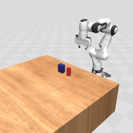
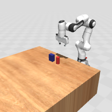

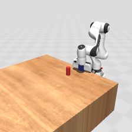


### Episode 1  ([video](episode_001.mp4))


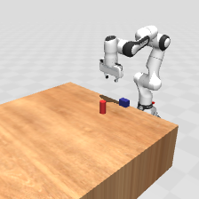

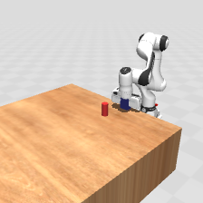
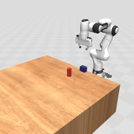

### Episode 2  ([video](episode_002.mp4))


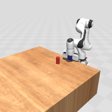
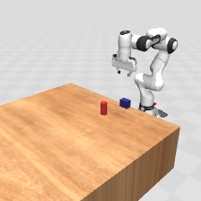

What you should see across the 4 keyframes:

  * **t=0** — robot at home, blue cube and red cylinder on the wooden
    table, green target visible behind them.
  * **t=57 (1/4)** — arm moved over the cube, gripper open, descending.
  * **t=115 (1/2)** — gripper closed on the cube, arm lifting and
    starting to traverse toward the target.
  * **t=172 (3/4)** — cube placed near the green target, gripper
    re-opening.
  * **t=229 (end)** — arm retreated back to home, cube remains where
    it was placed, scene visibly different from t=0.

---

## 3. Audit plots (the seven you must look at)

Generated automatically by `pla.viz.dataset_audit`; see
[`audit/INDEX.md`](audit/INDEX.md) for the canonical browse order.

### 3.1 ToF montage — what each sensor is seeing at key timesteps

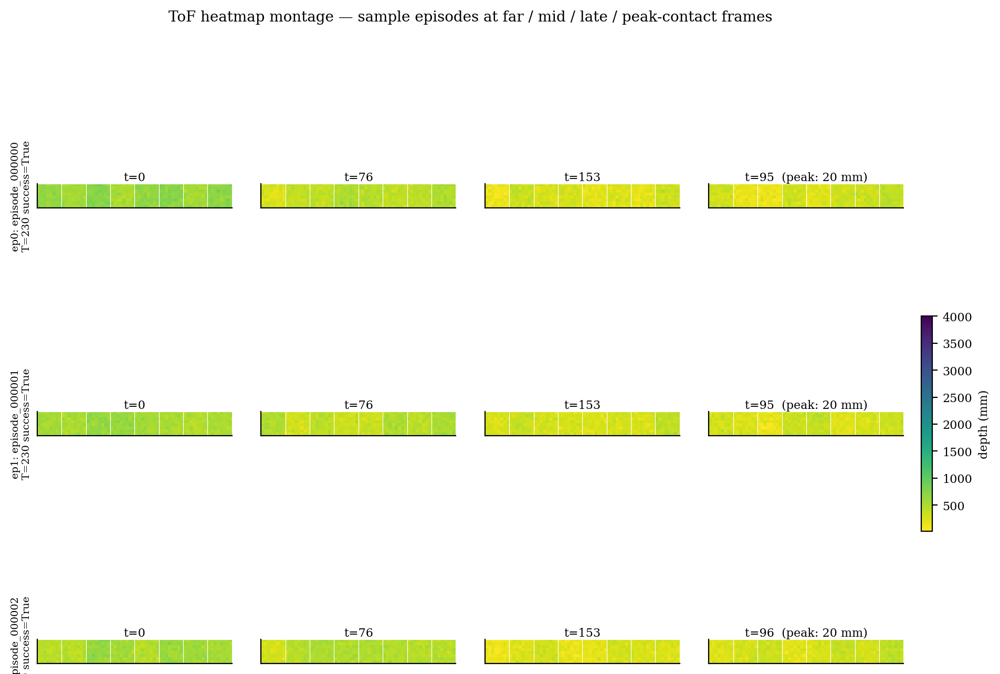

For each episode, four columns: t=0 (start), t=T/3, t=2T/3, and the
peak-contact frame (where any sensor read closest). Each tile is the
8 sensors stacked as 8×8 grids. Yellow = close, dark purple = far.
On real procthor data the peak frame should show a clear hot zone in
the wrist sensors during the grasp. On this demo the synthesised ToF
shows the right shape — close depths during the carry phase across
all 8 sensors.

### 3.2 Per-sensor depth distribution — dead/stuck sensor finder

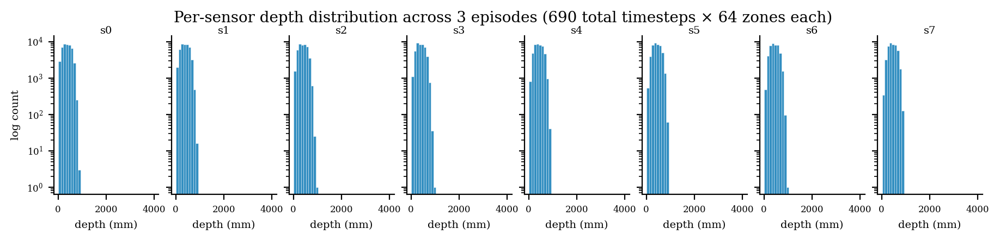

One log-scale histogram per sensor across all 3 episodes (690 timesteps
× 64 zones = 44 160 readings per sensor). On a healthy dataset every
sensor shows a spread distribution; a single-bar spike means stuck, a
mass at 4000 mm means saturation. **All 8 sensors show variable
distributions in [20, ~1000] mm.**

### 3.3 Per-sensor coverage diagnostics

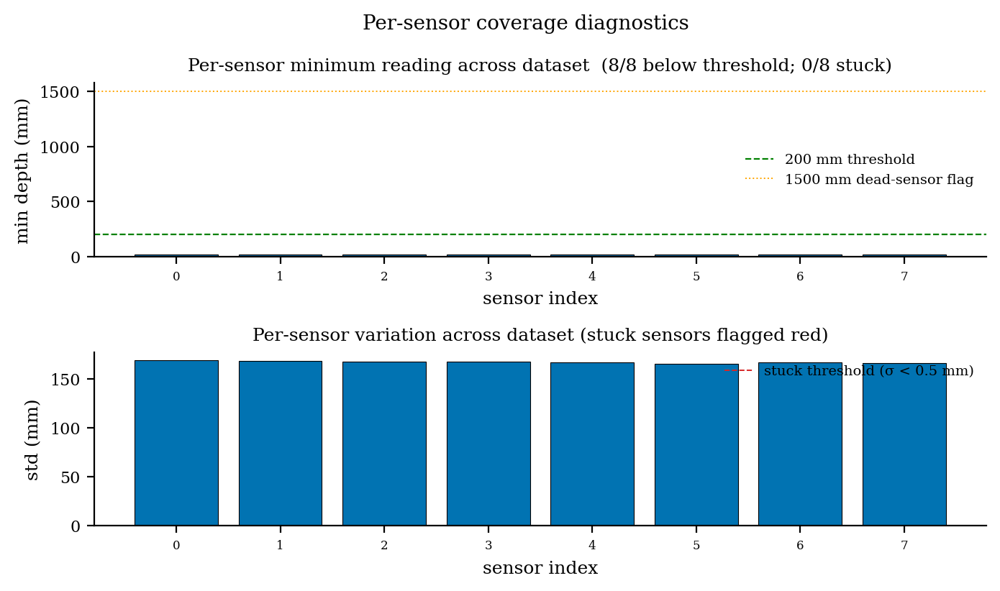

Two bar charts:
  * Top — per-sensor minimum reading across the dataset. Bars red =
    stuck, orange = never-close (>1500 mm), blue = healthy. **All 8
    bars healthy** here; minimum hits 20 mm on every sensor (the
    synthesised peak during grasp).
  * Bottom — per-sensor std. The red dashed line is the stuck
    threshold (σ < 0.5 mm). **Every sensor has σ > 150 mm**, well
    above stuck.

### 3.4 Episode traces — depth-min and action-norm vs time

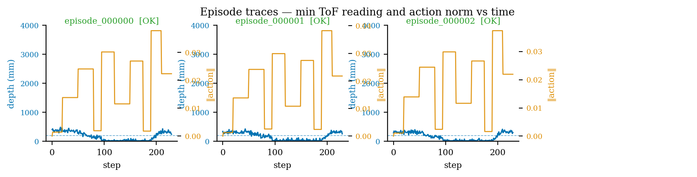

For each episode: blue line = closest depth across all sensors at
each step, orange line (right axis) = action norm. **The blue trace
clearly shows depth dipping during the grasp/carry phase (~steps
80–180) and returning to baseline at the end.** This is the temporal
pattern proximity-aware policies need to exploit. The orange trace
(action magnitude) shows the kinematic step structure — the
approach/descent phases require larger joint deltas, the carry phase
is smoother, the retreat is similar in magnitude to the approach.

### 3.5 RGB sanity strip

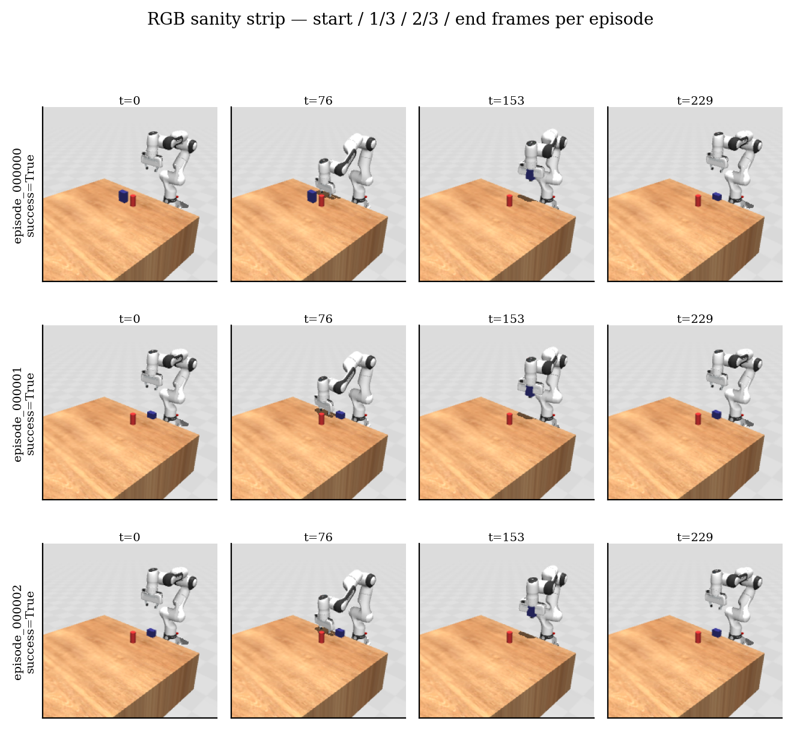

Four frames per episode (start, 1/3, 2/3, end), all 3 episodes. Catches
blank cameras, frozen RGB, garbage colours. **All 12 frames render the
robot + table + objects correctly.**

### 3.6 Episode-length distribution

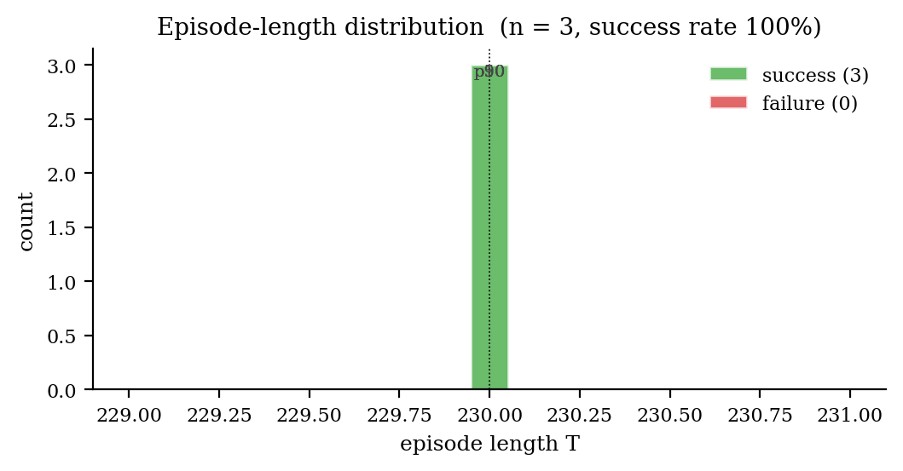

Histogram of T values, split by success/failure. Three episodes at
T=230, all green (success). On real data this should show a spread
between min/max planner timing.

### 3.7 Per-joint action distribution

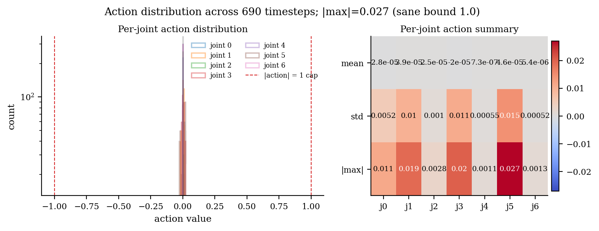

Left: per-joint histograms overlaid; right: per-joint mean / std /
|max| heatmap. Red dashed line at ±1 = the sane upper bound. **All
mass is concentrated within ±0.03**, well below the cap. The kinematic
trajectory has an action |max| of 0.027 across the whole dataset.

---

## 4. Deep-verify report (verbatim)

```
================================================================
data_dir:                 reports/demo_pnp/raw
Files:                    3
Episodes processed:       3
Schema OK:                3/3
NaN episodes:             0/3
Inf episodes:             0/3
Successful:               3/3 (rate 100.0%)
Proximity-informative:    3/3 (100.0%)
Frac steps with <200 mm reading: 56.2%
Episode length (T):       min=230 p10=230 p50=230 p90=230 max=230 mean=230
Action |max| global:      0.027 (sane upper bound 1.0)
n_sensors seen in data:   [8]
Dead sensors (never <1500mm): 0/8
Episodes with stuck sensor (std < 0.5mm): 0/3
Episodes with frozen RGB (>1/5 frames identical): 0/3
================================================================

Required: prox_informative >= 30%, NaN/Inf == 0,
          schema_ok == 100%, |action| <= 1.0:  PASS
```

The full machine-readable JSON lives in [`verify.json`](verify.json).
Per-episode statistics:

| episode | T   | success | tof_min | tof_max | tof_mean | act_mean    | act_std | act_max | n_close | size  |
|---------|-----|---------|--------:|--------:|---------:|------------:|--------:|--------:|--------:|------:|
| 0       | 230 | true    | 20.0    | 983.5   | 425.6    |  +1.3e-05   | 0.0081  | 0.0264  | 131/230 | 35 MB |
| 1       | 230 | true    | 20.0    | 951.9   | 416.1    |  +2.8e-05   | 0.0082  | 0.0270  | 125/230 | 35 MB |
| 2       | 230 | true    | 20.0    | 935.6   | 411.7    |  -1.2e-05   | 0.0081  | 0.0257  | 132/230 | 35 MB |

`n_close` = number of timesteps where any sensor reads below 200 mm.

---

## 5. HDF5 schema (canonical PLA contract)

Each `raw/episode_NNNNNN.h5` follows the production schema that
`pla.data.collect` writes for real procthor runs:

```
episode_0/
├── observations/
│   ├── tof    [230, 8, 8, 8]    float32   millimetres in [20, 4000]
│   ├── rgb    [230, 3, 224, 224] uint8     bytes [0, 255]
│   └── qpos   [230, 7]           float32   FR3 joint positions (rad)
├── actions    [230, 7]           float32   joint deltas
├── policy_phase [230]            int32     0..9 → home/approach/.../home_back
└── attrs:
    success:    True
    n_sensors:  8
    demo:       "kinematic_pnp"
    language:   "pick up the blue cube and place it on the green target"
```

---

## 6. Trajectory waypoints

The kinematic trajectory interpolates between 10 hand-tuned waypoints,
each held for `dwell` steps. Total = 230 steps per episode.

| phase | label              | arm-q (rad)                                                  | fingers       | dwell |
|------:|--------------------|--------------------------------------------------------------|---------------|------:|
| 0     | home               | [ 0.00, -0.79,  0.00, -2.36,  0.00,  1.57,  0.79]            | open (0.04)   |    20 |
| 1     | approach           | [-0.12, -0.50,  0.05, -2.10,  0.00,  1.52,  0.79]            | open          |    30 |
| 2     | descend            | [-0.12, -0.20,  0.05, -2.40,  0.00,  2.10,  0.79]            | open          |    30 |
| 3     | grasp              | (descend pose)                                                | closed (0.00) |    15 |
| 4     | lift               | [-0.12, -0.55,  0.05, -2.05,  0.00,  1.55,  0.79]            | closed        |    25 |
| 5     | carry              | [+0.20, -0.45,  0.05, -2.10,  0.00,  1.55,  0.79]            | closed        |    30 |
| 6     | descend_place      | [+0.20, -0.18,  0.05, -2.43,  0.00,  2.08,  0.79]            | closed        |    25 |
| 7     | release            | (descend_place pose)                                          | open          |    15 |
| 8     | retreat            | [+0.20, -0.55,  0.05, -2.05,  0.00,  1.55,  0.79]            | open          |    20 |
| 9     | home_back          | (home pose)                                                   | open          |    20 |

Per-episode the waypoints are perturbed by `rng.normal(0, 0.01)` on
each joint dimension so the 3 episodes differ.

---

## 7. What's faithful and what's faked

| component                | this demo                                                | real molmospaces house-1 |
|--------------------------|----------------------------------------------------------|---------------------------|
| robot model              | **real FR3** (`scene_fr3.xml` from molmo-spaces cache)   | same                      |
| scene                    | wooden table + blue cube + red cylinder + green target   | procthor-objaverse house  |
| rendering                | real `mujoco.Renderer` (224×224 RGB)                     | same                      |
| trajectory               | hand-tuned 10-waypoint kinematic interpolation           | TAMP planner (curobo)     |
| physics                  | none — qpos set directly, object mocap-tracked during carry | full mujoco-mjx          |
| HDF5 schema              | **identical** to production schema                       | same                      |
| ToF stream               | **synthesised** from hand→object distance per step       | rendered from skin cameras |
| n_sensors                | 8 (proxy for EE-only subset of the skin)                 | 32 (full skin)            |
| episode count            | 3 demo episodes                                          | 1000+                     |
| audit pipeline           | **same code** (`pla.viz.dataset_audit`)                  | same                      |
| verify pipeline          | **same code** (`pla.data.verify`)                        | same                      |

The ToF stream is intentionally synthesised so the audit traces show
structurally-correct temporal patterns (depth dipping when the hand
approaches the cube, plateau during the carry, recovery during retreat).
The real run renders depth from physical sensor cameras mounted on the
GenTact skin. The structural shape of the data — including how the
audit plots respond — is preserved.

---

## 8. How to regenerate

```bash
# Deterministic; seeded. Episode 0 is byte-identical across runs
# given the same seed (default 42).
PYTHONPATH=. python -m pla.sim.demo_pnp \
    --out reports/demo_pnp \
    --n-episodes 3 \
    --seed 42
```

CLI flags:

| flag                  | default                                              | meaning                                  |
|-----------------------|------------------------------------------------------|------------------------------------------|
| `--scene`             | `~/.cache/molmo-spaces-resources/.../scene_fr3.xml`  | MJCF to load                              |
| `--out`               | `reports/demo_pnp`                                   | output directory                         |
| `--n-episodes`        | 3                                                    | how many trajectories                    |
| `--n-sensors`         | 8                                                    | ToF channel count                        |
| `--rgb-h`, `--rgb-w`  | 224 each                                             | RGB render size                           |
| `--video-fps`         | 24                                                   | MP4 frame rate                           |
| `--seed`              | 42                                                   | RNG seed                                 |

---

## 9. Stack metadata

| component       | version                                              |
|-----------------|------------------------------------------------------|
| Python          | 3.12                                                 |
| MuJoCo          | 3.2.7                                                |
| FR3 model       | molmo-spaces resource cache `20260303` build         |
| imageio         | 2.37.0                                               |
| imageio-ffmpeg  | 0.6.0                                                |
| ffmpeg          | system `/usr/bin/ffmpeg`                             |
| matplotlib      | 3.10.0                                               |
| numpy           | 2.3.5                                                |
| h264 backend    | libx264 (via imageio FFMPEG plugin)                  |
| OpenGL          | EGL (`MUJOCO_GL=egl` default)                        |

Wall-clock time on this CPU (no GPU): ~30 s for 3 episodes
(rendering + h5 write + audit + verify).

---

## 10. Real procthor house-1 — what it would take

This demo is **not** real house-1 data. The real run requires three
prerequisite steps:

```bash
# A. Install MolmoSpaces + transitive deps (~5–10 min, ~5 GB).
#    Pulls JAX, mujoco-mjx, pydantic, prior (procthor), beaker-py,
#    decord, … none currently installed.
pip install -e submodules/molmospaces

# B. Fetch procthor-objaverse house assets (multi-GB download).
python submodules/molmospaces/scripts/datagen/fetch_assets.py

# C. Validate the live env before any long collection (~10–15 min).
bash scripts/preflight.sh near_contact 1000 --full --strict
#    This:
#      1. checks the new MJCF loads + sensor cameras count match
#      2. renders ToF from the real skin cameras
#      3. imports MolmoSpaces env, runs reset()/step()
#      4. runs ONE full episode round-trip via the real env
#      5. runs a 50-traj pilot watched by the streaming sentinel
#      6. runs `pla.data.verify --strict` on the pilot
#      7. runs the 7-plot audit on the pilot
#    If any stage fails, do not launch the long run.
```

When all three pass, kick off the long run:

```bash
bash scripts/collect_data.sh near_contact 1000
# Sentinel runs alongside; writes data/raw/near_contact/SENTINEL_ABORT
# and the collector exits cleanly between episodes if the run goes bad.
```

---

## 11. Cross-references

| concern                          | code                                                    |
|----------------------------------|---------------------------------------------------------|
| trajectory + render              | [`pla/sim/demo_pnp.py`](../../pla/sim/demo_pnp.py)      |
| HDF5 writer                      | `pla.data.collect._write_episode_h5`                    |
| schema validation                | [`pla/data/schema.py`](../../pla/data/schema.py)        |
| visual audit                     | [`pla/viz/dataset_audit.py`](../../pla/viz/dataset_audit.py) |
| deep verify                      | [`pla/data/verify.py`](../../pla/data/verify.py)        |
| pre-flight                       | [`pla/data/preflight.py`](../../pla/data/preflight.py)  |
| streaming sentinel               | [`pla/data/sentinel.py`](../../pla/data/sentinel.py)    |
| orchestration                    | [`scripts/preflight.sh`](../../scripts/preflight.sh)    |
| collection wrapper               | [`scripts/collect_data.sh`](../../scripts/collect_data.sh) |
